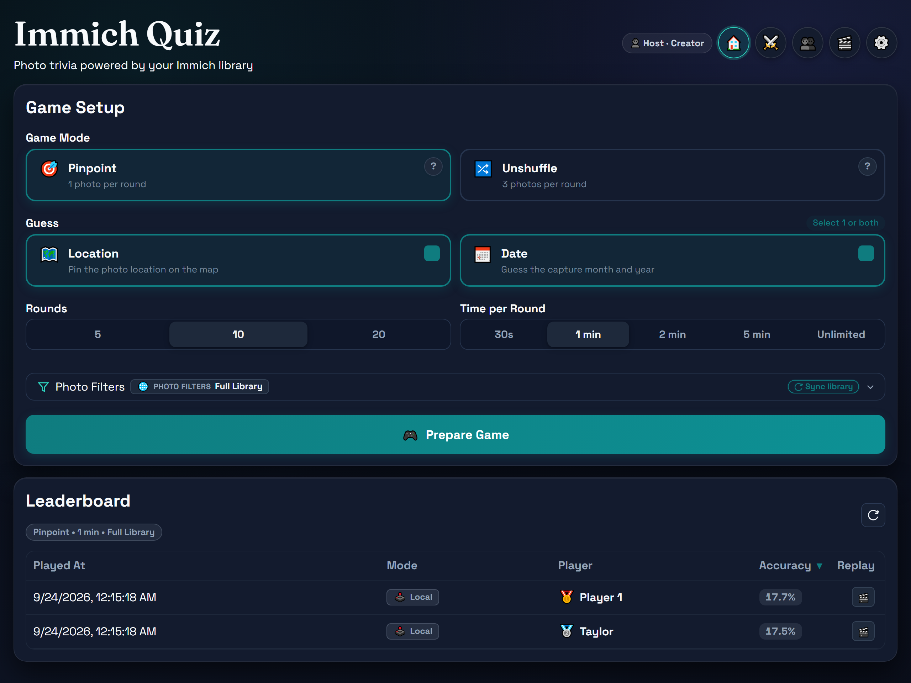

# Immich Quiz

[](https://github.com/rafaelsavi/immich-quiz/releases)
[](https://github.com/rafaelsavi/immich-quiz/pkgs/container/immich-quiz)
[](https://github.com/rafaelsavi/immich-quiz/actions/workflows/ci.yml)

Immich Quiz is a pass-and-play trivia game that generates rounds from your Immich photos. Players take turns guessing where and when photos were taken in **Pinpoint** mode, or matching photo batches to map pins and timeline dates in **Album Shuffle** mode.



---

## Playing the Game

- Start the app in your browser after launching the server.
- Select players, choose a game mode (**Pinpoint** or **Album Shuffle**), rounds, round length, guess mode, and library.
- Optionally filter photos by album, custom date range, country, city, or tagged people (with Any / All matching).
- Take turns guessing photo locations, capture dates, or both.
- Review end-of-match performance awards and the leaderboard when the game ends.

See [docs/GAMEPLAY.md](docs/GAMEPLAY.md) for the full gameplay walkthrough. For scoring details, see [docs/SCORING.md](docs/SCORING.md).

---

## Self-Hosting

### Container Image & Tag Reference

The official Docker image is published to GitHub Container Registry (GHCR):

`ghcr.io/rafaelsavi/immich-quiz`

| Tag                  | Description                       | Command                                             |
|----------------------|-----------------------------------|-----------------------------------------------------|
| `:latest`            | Latest build from `main` branch   | `docker pull ghcr.io/rafaelsavi/immich-quiz:latest` |
| `:rc`                | Latest Release Candidate build    | `docker pull ghcr.io/rafaelsavi/immich-quiz:rc`     |
| `:v1.0.0` / `:1.0.0` | Specific semantic release version | `docker pull ghcr.io/rafaelsavi/immich-quiz:v1.0.0` |
| `:<sha>`             | Exact commit hash build           | `docker pull ghcr.io/rafaelsavi/immich-quiz:<sha>`  |

### Starting the server

Create your `.env` configuration file from `.env.example`:

```bash
cp .env.example .env
```

Edit `.env` to set your `IMMICH_SERVER_URL`, `IMMICH_LIBRARIES`, and optional settings.

Start the container with Docker Compose using the provided [docker-compose.example.yml](docker-compose.example.yml):

```bash
cp docker-compose.example.yml docker-compose.yml
docker compose up -d
```

Docker Compose reads configuration directly from your `.env` file via `env_file`. Mount the `./data` volume to store the SQLite database and persist metadata index and leaderboard scores across container restarts.

### Environment Variables

| Variable                           | Required | Default                | Notes                                                                         |
|------------------------------------|----------|------------------------|-------------------------------------------------------------------------------|
| `IMMICH_SERVER_URL`                | Yes      | —                      | Full URL to the Immich API, e.g. `https://photos.example.com/api`             |
| `IMMICH_LIBRARIES`                 | Yes      | —                      | JSON object mapping display names to API keys, e.g. `{"Family": "key123"}`    |
| `APP_TITLE`                        | No       | `Immich Quiz`          | Browser tab title and main heading shown on the landing page                  |
| `APP_TAGLINE`                      | No       |                        | Optional tagline shown below the main heading on the landing page             |
| `DATE_LOWER_BOUND`                  | No       | —                      | Inclusive lower date bound (`YYYY-MM-DD`) for photos fetched into quiz rounds |
| `DATE_UPPER_BOUND`                  | No       | —                      | Inclusive upper date bound (`YYYY-MM-DD`) for photos fetched into quiz rounds |
| `COUNTRY_WHITELIST`                | No       | —                      | Comma-separated list of allowed countries in filters (case-insensitive)       |
| `COUNTRY_BLACKLIST`                | No       | —                      | Comma-separated list of excluded countries in filters (case-insensitive)      |
| `CITY_WHITELIST`                   | No       | —                      | Comma-separated list of allowed cities/regions in filters (case-insensitive)  |
| `CITY_BLACKLIST`                   | No       | —                      | Comma-separated list of excluded cities/regions in filters (case-insensitive) |
| `PEOPLE_WHITELIST`                 | No       | —                      | Comma-separated list of allowed people names in filters (case-insensitive)    |
| `DATA_PATH`                        | No       | `data`                 | Directory for SQLite persistence (`metadata.db` and `leaderboard.db`)        |
| `AUTO_SYNC_ON_STARTUP`             | No       | `true`                 | Auto-trigger metadata sync in the background on server startup                |
| `APP_HOST`                         | No       | `127.0.0.1`            | Set to `0.0.0.0` in Docker so the port is reachable from the host             |
| `APP_PORT`                         | No       | `8010`                 | Port the app listens on                                                       |
| `SCORE_MAX_POINTS`                 | No       | `100`                  | Max points per enabled goal, per turn                                         |
| `LOCATION_SCORE_DECAY_KM`          | No       | `500`                  | Location decay constant in km for `exp(-distance/decay)`                      |
| `DATE_SCORE_DECAY_DAYS`            | No       | `500`                  | Date decay constant in days for `exp(-delta_days/decay)`                      |
| `LANGUAGE`                         | No       | `EN`                   | UI language (`EN` for English, `PT` for Brazilian Portuguese)                 |

### Immich API Token Permissions

The `IMMICH_LIBRARIES` value is a JSON object where keys are display names of the libraries and values are Immich v3 API keys. Each API key must be custom-scoped with exactly the following permissions:

- `asset.read` — required for photo search.
- `album.read` — required for album listing.
- `asset.view` — required for visualization.

The app requests preview thumbnails only; original files are never downloaded.

---

## Development

### Quick Start

1. Install dependencies:

```bash
uv sync --extra dev
```

1. Use `.env.example` to create a local `.env` file for local development.
2. Start the app:

```bash
uv run -m src.main
```

### Tests and Quality Gates

#### Pre-push Hook

To enable automatic pre-push CI checks locally:

```bash
git config core.hooksPath .githooks
```

#### Run all tests manually

```bash
uv run pytest -q
uv run ruff check .
uv run mypy src
uv run pytest --cov=src --cov-report=term-missing
```

### VS Code Integration (Tasks & Debugging)

If you use VS Code, pre-configured tasks and launch files are available in `.vscode/`:

- **Run / Debug App (`F5`)**: Use the `FastAPI: Debug App (Uvicorn)` launch profile or press **F5** to start the app with debugging and hot reload.
- **Run Tasks (`Ctrl+Shift+B` / `Cmd+Shift+B`)**: Access project tasks via **Terminal > Run Task**:
  - `Run App`: Start the dev server (`uv run python src/main.py`).
  - `Run Pytest`: Execute test suite (`uv run pytest`).
  - `Run All CI Checks`: Run Ruff, Mypy, and Pytest coverage in sequence.

### Audio Testing Playground

An interactive playground is available at [`/audio-playground`](http://localhost:8010/audio-playground) (or [`/static/audio-playground.html`](http://localhost:8010/static/audio-playground.html)) for testing, custom-synthesizing, and auditing sound effects built into `static/js/modules/audio.js`. See [docs/AUDIO_PLAYGROUND.md](docs/AUDIO_PLAYGROUND.md) for details.

### Documentation

- [CHANGELOG.md](CHANGELOG.md) — release history and notable changes
- [docs/GAMEPLAY.md](docs/GAMEPLAY.md) — gameplay rules, setup parameters, and UI walkthrough
- [docs/ARCHITECTURE.md](docs/ARCHITECTURE.md) — module design, anti-cheat boundary, and data flow
- [docs/API.md](docs/API.md) — full API contract and response schemas
- [docs/SCORING.md](docs/SCORING.md) — mathematical scoring formulas and decay reference tables
- [docs/AUDIO_PLAYGROUND.md](docs/AUDIO_PLAYGROUND.md) — Web Audio sound engine documentation and testing playground guide
- [docs/AWARDS.md](docs/AWARDS.md) — guide to performance awards, criteria, and customization instructions
- [docs/TODO.md](docs/TODO.md) — project roadmap and backlog for planned features and technical tasks
