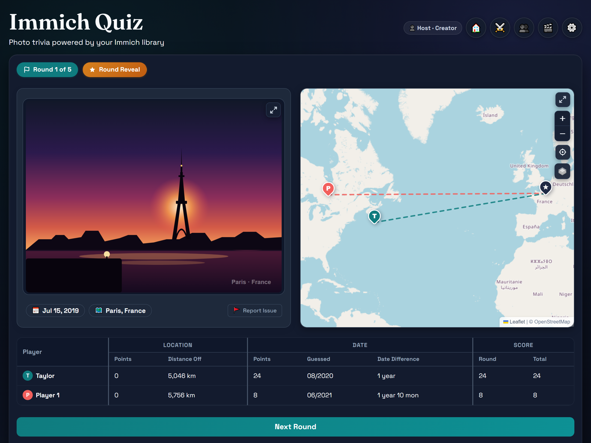
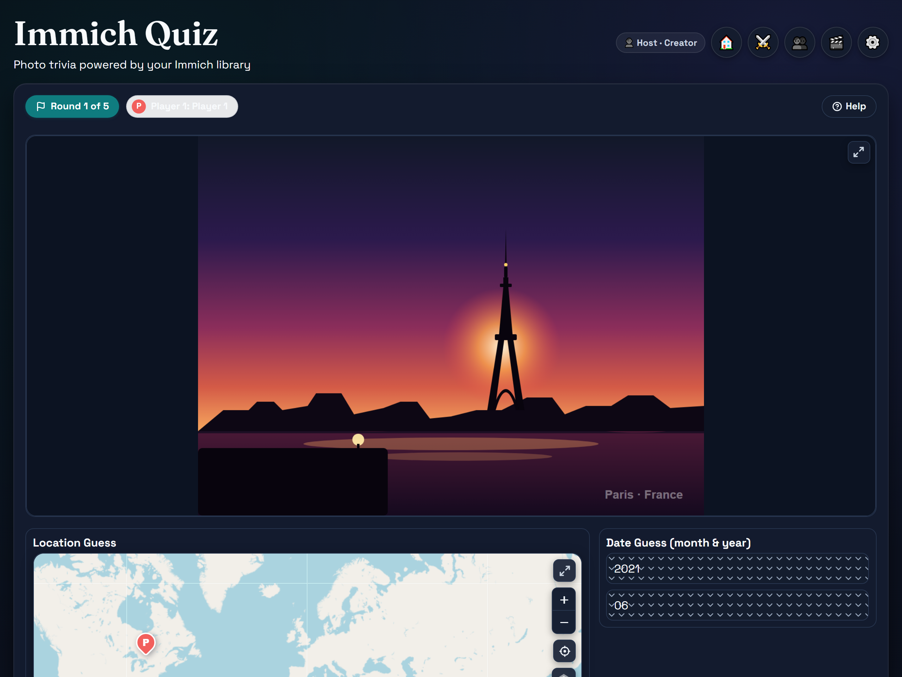
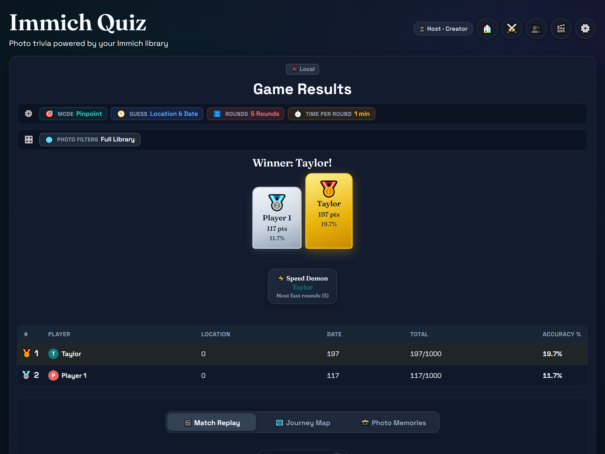

# 📸 Immich Quiz

<p align="center">
  <strong>Turn your self-hosted Immich photo library into an interactive, multiplayer trivia game.</strong>
</p>

<p align="center">
  <a href="https://github.com/rafaelsavi/immich-quiz/releases"></a>
  <a href="https://github.com/rafaelsavi/immich-quiz/pkgs/container/immich-quiz"></a>
  <a href="https://github.com/rafaelsavi/immich-quiz/actions/workflows/ci.yml"></a>
  <a href="https://github.com/immich-app/immich"></a>
  <a href="LICENSE"></a>
  
</p>

<p align="center">
  <a href="#-key-features">Key Features</a> •
  <a href="#-quick-start-30-seconds">Quick Start</a> •
  <a href="#-game-modes">Game Modes</a> •
  <a href="#-screenshots">Screenshots</a> •
  <a href="#-self-hosting">Self-Hosting</a> •
  <a href="#-role-based-access-control-cloudflare-zero-trust">RBAC & Security</a> •
  <a href="#-documentation">Documentation</a>
</p>

---



<p align="center">
  <em>Challenge your memory of where and when your photos were taken. See distance vectors, score rollups, and exact capture dates.</em>
</p>

---

## ✨ Key Features

- **🌍 GeoGuessr for Your Personal Photos**: Guess where and when your photos were taken using interactive Leaflet maps with dynamic auto-zoom and month/year timeline selectors.
- **🔀 Unshuffle Mode**: Match photo clusters to geographic markers and arrange your memories into chronological sequence along a timeline.
- **🕹️ Couch Multiplayer (Pass & Play)**: Gather friends around a single TV or tablet. A privacy curtain protects upcoming photos between player turns.
- **⚔️ Asynchronous & Hybrid Challenges**: Share capability URLs (`/play/ch_...`) or instant QR codes with customizable expiration periods. Opponents play at their own pace on their own devices with live opponent updates.
- **📊 Lifetime Player Directory & KPIs**: Track player records, win rates, podium medals, and 4-tier accuracy distributions for Location and Date across player profiles.
- **🎬 Match Replays & Photo Journey**: Relive past matches with full route replays, stage cards, and high-res photo memories.
- **⚡ Sub-Millisecond SQLite Metadata Engine**: Fast, local SQLite indexing with automatic delta and full background syncs from Immich. Zero lag during matches.
- **🛡️ Anti-Cheat & Privacy-First**: All EXIF, GPS coordinates, and camera metadata are stripped server-side before client delivery.
- **🔐 Granular Role-Based Access Control**: Native Cloudflare Zero Trust and reverse proxy integration with three permission tiers (👑 Creator, 👥 Player, 🎟️ Guest).
- **🌓 Clear & Dark Themes + i18n**: Aesthetic design with automatic dark/light theme switching and bilingual support in English (`en-US`) and Brazilian Portuguese (`pt-BR`).

---

## 📸 Screenshots

|                                      🎮 Setup Lobby & Smart Filters                                       |                                      🎯 Pinpoint Interactive Guessing                                      |
|:---------------------------------------------------------------------------------------------------------:|:----------------------------------------------------------------------------------------------------------:|
|                      [](docs/assets/home.webp)                       |       [](docs/assets/gameplay_pinpoint.webp)       |
| *Bento setup grid, cascade filters (album, date range, country, city, people), and live preflight count.* | *High-res photo preview, interactive Leaflet world map with drop pin, date selector, and countdown timer.* |

|                                🗺️ Round Reveal & Distance Vectors                                 |                                  🏆 Winner Podium & Review Deck                                   |
|:-------------------------------------------------------------------------------------------------:|:-------------------------------------------------------------------------------------------------:|
|          [](docs/assets/round_reveal.webp)          |       [](docs/assets/summary_podium.webp)       |
| *True photo location star, player pins, dashed distance vectors, and itemized scoring breakdown.* | *Podium medals (🥇, 🥈, 🥉), dynamic performance awards, standings table, and 3-tab review deck.* |

---

## 🎮 Game Modes

### Modes & Targets

- **🎯 Pinpoint Mode**: 1 photo per round. Place a pin on the interactive Leaflet map and/or guess the capture month and year.
- **🔀 Unshuffle Mode**: 3 photos per round. Match photos to lettered map pins and/or arrange them in chronological sequence along a timeline.
- **Target Selection**: Play with **Location only**, **Date only**, or **Location & Date**.

### Play Formats

- **🕹️ Local Match (Pass & Play)**: Gather friends around a single screen. Players take turns passing the device between rounds with an overlay privacy curtain protecting upcoming photos.
- **⚔️ Multiplayer Challenges (Async & Hybrid)**: Click **Prepare Game** to generate an unguessable capability link (e.g. `/play/ch_...`) and QR code with a custom expiration window. Friends join from their own mobile or desktop browsers, see live opponent pin drops as rounds complete, and view the final 3D podium.

### Explore

- **⚔️ Challenges Hub (`/challenges`)**: Browse, join, share, and track active online challenges.
- **📊 Player Statistics & Profiles (`/players`)**: Explore lifetime stats, win rates, medal podiums, 4-tier accuracy distributions for Location & Date, and player match histories.
- **🎬 Match Reviews & Replays (`/replays` & `/game/{match_id}/replay`)**: Review completed games with an outcome hero (winner podium, final standings) and interactive segmented review deck featuring round-by-round replays, full-game journey maps, and photo memories.
- **Reported Assets Dashboard (`/reported`)**: Review reported photo metadata inconsistencies (GPS, date, notes), open direct Immich Web edit links, and resolve reports in real time.

### Select your media pool

Optionally filter photos by album, custom date range, country, city, or tagged people (with Any / All matching). A live preflight indicator verifies that enough diverse, geotagged, and dated photos exist before the match starts.

See [docs/GAMEPLAY.md](docs/GAMEPLAY.md) for the full gameplay walkthrough, [docs/CHALLENGES.md](docs/CHALLENGES.md) for the multiplayer challenge guide, and [docs/SCORING.md](docs/SCORING.md) for mathematical scoring details.

---

## 🐳 Self-Hosting

### Container Image & Tag Reference

The official Docker image is published to GitHub Container Registry (GHCR):

`ghcr.io/rafaelsavi/immich-quiz`

| Tag                  | Description                                                | Command                                             |
|----------------------|------------------------------------------------------------|-----------------------------------------------------|
| `:latest`            | Latest official stable release (multi-arch: amd64 / arm64) | `docker pull ghcr.io/rafaelsavi/immich-quiz:latest` |
| `:rc`                | Latest Release Candidate build                             | `docker pull ghcr.io/rafaelsavi/immich-quiz:rc`     |
| `:v3.2.0` / `:3.2.0` | Specific semantic release version                          | `docker pull ghcr.io/rafaelsavi/immich-quiz:v3.2.0` |
| `:<sha>`             | Exact commit hash build                                    | `docker pull ghcr.io/rafaelsavi/immich-quiz:<sha>`  |

### Quick Start

Use the example files:

- [.env.example](.env.example)
- [docker-compose.example.yml](docker-compose.example.yml)

### Environment Variables

| Variable                         | Required | Default       | Notes                                                                                                                                                                                                            |
|----------------------------------|----------|---------------|------------------------------------------------------------------------------------------------------------------------------------------------------------------------------------------------------------------|
| `IMMICH_SERVER_URL`              | Yes      | —             | Full URL to the Immich API, e.g. `https://photos.example.com/api`                                                                                                                                                |
| `IMMICH_LIBRARIES`               | Yes      | —             | JSON object mapping display names to API keys, e.g. `{"Family": "key123"}`                                                                                                                                       |
| `APP_TITLE`                      | No       | `Immich Quiz` | Browser tab title and main heading shown on the landing page                                                                                                                                                     |
| `APP_TAGLINE`                    | No       |               | Optional tagline shown below the main heading on the landing page                                                                                                                                                |
| `DATE_LOWER_BOUND`               | No       | —             | Inclusive lower date bound (`YYYY-MM-DD`) for photos fetched into quiz rounds                                                                                                                                    |
| `DATE_UPPER_BOUND`               | No       | —             | Inclusive upper date bound (`YYYY-MM-DD`) for photos fetched into quiz rounds                                                                                                                                    |
| `COUNTRY_WHITELIST`              | No       | —             | Comma-separated list of allowed countries in filters (case-insensitive)                                                                                                                                          |
| `COUNTRY_BLACKLIST`              | No       | —             | Comma-separated list of excluded countries in filters (case-insensitive)                                                                                                                                         |
| `CITY_WHITELIST`                 | No       | —             | Comma-separated list of allowed cities/regions in filters (case-insensitive)                                                                                                                                     |
| `CITY_BLACKLIST`                 | No       | —             | Comma-separated list of excluded cities/regions in filters (case-insensitive)                                                                                                                                    |
| `PEOPLE_WHITELIST`               | No       | —             | Comma-separated list of allowed people names or IDs in filters (case-insensitive)                                                                                                                                |
| `PEOPLE_BLACKLIST`               | No       | —             | Comma-separated list of excluded people names or IDs in filters (case-insensitive)                                                                                                                               |
| `TAG_WHITELIST`                  | No       | —             | Comma-separated list of allowed asset tag names or IDs in filters (case-insensitive)                                                                                                                             |
| `TAG_BLACKLIST`                  | No       | —             | Comma-separated list of excluded asset tag names or IDs in filters (case-insensitive)                                                                                                                            |
| `EXCLUDE_FLAGGED_ASSETS`         | No       | `true`        | Exclude reported photos with metadata inconsistencies from question pools (default: true)                                                                                                                        |
| `DATA_PATH`                      | No       | `data`        | Directory for SQLite persistence (`metadata.db` and `leaderboard.db`)                                                                                                                                            |
| `AUTO_SYNC_ON_STARTUP`           | No       | `true`        | Auto-trigger metadata sync in the background on server startup                                                                                                                                                   |
| `AUTO_DELTA_SYNC_INTERVAL_HOURS` | No       | `6`           | Interval in hours for periodic delta metadata sync (`0` disables)                                                                                                                                                |
| `AUTO_FULL_SYNC_INTERVAL_HOURS`  | No       | `120`         | Interval in hours for periodic full metadata sync & pruning (`0` disables)                                                                                                                                       |
| `SYNC_COOLDOWN_SECONDS`          | No       | `60`          | Cooldown period in seconds between manual sync triggers (`0` disables)                                                                                                                                           |
| `APP_HOST`                       | No       | `127.0.0.1`   | Set to `0.0.0.0` in Docker so the port is reachable from the host                                                                                                                                                |
| `APP_PORT`                       | No       | `8010`        | Port the app listens on                                                                                                                                                                                          |
| `LOG_LEVEL`                      | No       | `INFO`        | Global logging verbosity (`DEBUG`, `INFO`, `WARNING`, `ERROR`). Optional subsystem overrides: `LOG_LEVEL_SCORING`, `LOG_LEVEL_SYNC`, `LOG_LEVEL_IMMICH`, `LOG_LEVEL_MATCH`, `LOG_LEVEL_API`, `LOG_LEVEL_STORAGE` |
| `LANGUAGE`                       | No       | `EN`          | UI language (`EN` for English, `PT` for Brazilian Portuguese)                                                                                                                                                    |
| `AUTH_MODE`                      | No       | `disabled`    | Access control mode (`disabled` for single-tenant / full host access; `cloudflare` for Zero Trust header enforcement)                                                                                            |
| `CF_CREATOR_EMAILS`              | No       | —             | Comma-separated emails granted Creator role (game creation, filter setup, library inspection, reported asset moderation)                                                                                         |
| `CF_USER_EMAILS`                 | No       | —             | Comma-separated emails granted User role (join & play challenges, explore stats directory, view match replays)                                                                                                   |

---

## 🔐 Role-Based Access Control (Cloudflare Zero Trust)

Immich Quiz supports granular access control to separate host administrative capabilities from player and guest access:

| Role                 | Lobby View                | Challenges              | Stats & Replays | Library Config & Pass & Play | Reported Assets |
|:---------------------|:--------------------------|:------------------------|:----------------|:-----------------------------|:----------------|
| **👑 Creator**       | Setup Card (full filters) | Create & Play           | Full Access     | Full Access                  | Full Access     |
| **👥 Player (User)** | Welcome Card (code input) | Join & Play             | Full Access     | No                           | No              |
| **🎟️ Guest**         | Welcome Card (code input) | Direct Link / Code Play | No              | No                           | No              |

### Cloudflare Zero Trust Setup

When exposing Immich Quiz behind a [Cloudflare Tunnel](https://developers.cloudflare.com/cloudflare-one/connections/connect-networks/) with Cloudflare Access:

1. Configure an Access Application in your Cloudflare Zero Trust dashboard protecting your quiz subdomain.
2. Under Access Policies, define which email addresses or identity providers can authenticate.
3. In your `.env` file, enable Cloudflare authentication mode and map verified email addresses or usernames:

   ```env
   AUTH_MODE=cloudflare
   CF_CREATOR_EMAILS=host@yourdomain.com,admin_user
   CF_USER_EMAILS=friend1@example.com,friend2@example.com,alice
   ```

4. Cloudflare automatically injects the `Cf-Access-Authenticated-User-Email` header upon successful authentication. Requests without this header or with unlisted identifiers automatically receive the **Guest** role (allowing public or shared challenge participation without exposing host configurations or player directories).

### User Name & Display Name Resolution

Immich Quiz resolves the player display name using the following priority order:

1. **Custom Name Headers**:
   - `Cf-Access-Authenticated-User-Name`
   - `X-User-Name`
   - `X-Auth-Name`
   - `X-Forwarded-User-Name` / `X-Forwarded-User`
   - `Remote-User`
2. **Cloudflare JWT Claims (`Cf-Access-Jwt-Assertion`)**:
   - The edge JWT payload is safely inspected for claims: `name`, `preferred_username`, `user_name`, or `given_name`.
3. **Email Fallback**:
   - If no explicit name header or claim is provided, the display name falls back to the capitalized email prefix (`email.split('@')[0].capitalize()`).

> [!TIP]
> **Allowlist Matching by Username**: You can specify usernames alongside emails in `CF_CREATOR_EMAILS` and `CF_USER_EMAILS`. Immich Quiz validates both the verified email and the resolved lowercase username/name.

### Configuring Caddy Reverse Proxy

If using **Caddy** as a reverse proxy in front of Immich Quiz:

- **Behind Cloudflare Access**: Caddy automatically forwards incoming `Cf-Access-*` headers to upstream:

  ```caddy
  quiz.yourdomain.com {
      reverse_proxy 127.0.0.1:8010
  }
  ```

- **With Caddy HTTP Basic Auth or Forward Auth**: Forward user identity directly via `X-User-Name`:

  ```caddy
  quiz.yourdomain.com {
      basicauth {
          admin  $2a$14$...
          alice  $2a$14$...
      }

      reverse_proxy 127.0.0.1:8010 {
          header_up X-User-Name {http.auth.user.id}
      }
  }
  ```

### Immich API Key Permissions

The `IMMICH_LIBRARIES` variable is a JSON object where keys are display names for your libraries and values are Immich API keys (e.g. `{"Family": "apiKey123"}`).

API keys can be generated in Immich under **Account Settings > API Keys**. Following the principle of least privilege, each API key only requires read/view access:

| Permission Scope | Required For                | Endpoints Used                                       | Description                                                                                                                           |
|:-----------------|:----------------------------|:-----------------------------------------------------|:--------------------------------------------------------------------------------------------------------------------------------------|
| `asset.read`     | Asset Metadata & Sync       | `POST /search/metadata`<br>`POST /search/statistics` | Discovers photos/videos, extracts EXIF coordinates/dates, computes library statistics, and validates connection.                      |
| `asset.view`     | Gameplay Image Previews     | `GET /assets/{id}/thumbnail`                         | Streams compressed preview thumbnails during active quiz rounds. *(Original full-resolution files are never accessed or downloaded).* |
| `album.read`     | Album Filtering & Shuffle   | `GET /albums`<br>`GET /albums/{id}`                  | Fetches album listings and album asset associations for setup filters and Unshuffle mode.                                             |
| `person.read`    | People / Face Filters       | `GET /people`                                        | Discovers recognized people and names for setup filtering (Any / All matching) and whitelist/blacklist rules.                         |
| `tag.read`       | Asset Tag Filters           | `GET /tags`                                          | Retrieves custom asset tags for setup filtering and tag whitelist/blacklist rules.                                                    |
| `user.read`      | Ownership & Sharing Context | `GET /users/me`                                      | Identifies the authenticated account to distinguish personal photos from shared albums and partner assets.                            |

---

## 🛠️ Development

### Local Setup

1. Install dependencies and browser binaries:

```bash
uv sync --extra dev
uv run playwright install chromium
```

1. Start the dev server:

```bash
uv run python -m src.main
```

### Automated Tests & Quality Gates

```bash
# Run unit and API tests
uv run pytest tests/ -k "not e2e"

# Run Playwright end-to-end browser tests
uv run pytest tests/e2e

# Run linters and type checkers
uv run ruff check .
uv run ruff format --check
uv run mypy src

# Generate documentation screenshots (100% anonymized vector artwork)
uv run python scripts/generate_screenshots.py
```

### Audio Testing Playground

An interactive playground is available at [`/audio-playground`](http://localhost:8010/audio-playground) for testing, custom-synthesizing, and auditing sound effects built into `static/js/modules/audio.js`. See [docs/AUDIO_PLAYGROUND.md](docs/AUDIO_PLAYGROUND.md) for details.

---

## 📚 Documentation

- [CHANGELOG.md](CHANGELOG.md) — Release history and notable changes
- [docs/GAMEPLAY.md](docs/GAMEPLAY.md) — Gameplay rules, setup parameters, and UI walkthrough
- [docs/CHALLENGES.md](docs/CHALLENGES.md) — Multiplayer challenge mode guide, capability tokens, and architecture
- [docs/ARCHITECTURE.md](docs/ARCHITECTURE.md) — Module design, anti-cheat boundary, and data flow
- [docs/FILTERS.md](docs/FILTERS.md) — Setup filter architecture, cascading multi-selects, and live preflight validation
- [docs/SYNC.md](docs/SYNC.md) — Metadata synchronization engine, SQLite schema, and background worker architecture
- [docs/API.md](docs/API.md) — Full API contract and response schemas
- [docs/SCORING.md](docs/SCORING.md) — Mathematical scoring formulas and decay reference tables
- [docs/AUDIO_PLAYGROUND.md](docs/AUDIO_PLAYGROUND.md) — Web Audio sound engine documentation and testing playground guide
- [docs/AWARDS.md](docs/AWARDS.md) — Guide to performance awards, criteria, and customization instructions
- [docs/RELEASES.md](docs/RELEASES.md) — Release workflow, semantic versioning rules, and CI/CD pipelines
- [docs/TODO.md](docs/TODO.md) — Project roadmap and backlog for planned features and technical tasks

---

<p align="center">
  Released under the <a href="LICENSE">MIT License</a>. Made for the self-hosted community.
</p>
