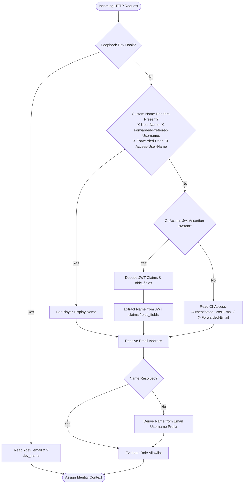

# Authentication & Access Control (Zero Trust)

Immich Quiz provides a zero-trust, role-based access control (RBAC) architecture designed to secure administrative host controls while delivering a frictionless gameplay experience for players and guests.

---

## 1. Role Hierarchy & Capabilities

The application divides permissions across three distinct roles:

| Role | Lobby View | Challenges Hub | Stats & Directory | Replay Viewer | Game Setup & Libraries | Reported Assets |
|:---|:---|:---|:---|:---|:---|:---|
| **👑 Creator** | Setup Card (full filters) | Create, Manage & Play | Full Access | Full Access | Full Access | Full Access |
| **👥 User** *(Player)* | Welcome Card (code input) | Join & Play | Full Access | Full Access | Restricted | Restricted |
| **🎟️ Guest** | Welcome Card (code input) | Direct Link / Code Play | Restricted | Restricted | Restricted | Restricted |

- **Creator (Host)**: Complete administrative control over game parameters, library configurations, photo moderation, challenge creation, leaderboard directories, and match history.
- **User (Registered Player)**: Access to community leaderboards, historical match replays, player directory profiles, and active challenge lobbies. Cannot modify library sources, generate API tokens, or moderate flagged photos.
- **Guest (Visitor)**: Temporary or unauthenticated player participating via challenge links or room codes. Replays, global leaderboards, and directory profiles are hidden to preserve player privacy.

---

## 2. Configuration & Modes

Access control is configured via environment variables:

| Variable | Default | Description |
|:---|:---|:---|
| `AUTH_MODE` | `disabled` | Set to `cloudflare` (or `cf`) to enforce Zero Trust identity checks. Set to `disabled` for local single-player / trust-all setups. |
| `CF_CREATOR_EMAILS` | `""` | Comma-separated list of emails or usernames granted the **Creator** role. |
| `CF_USER_EMAILS` | `""` | Comma-separated list of emails or usernames granted the **User** role. |

### Single-Player / Disabled Mode (`AUTH_MODE=disabled`)
When `AUTH_MODE` is unset or set to `disabled`:
- Every visitor is automatically assigned the **Creator** role.
- The default player display name is set to `'Host'`.
- Suitable for private home networks, desktop testing, or single-user deployments.

### Zero Trust Mode (`AUTH_MODE=cloudflare`)
When `AUTH_MODE=cloudflare`:
- Every incoming request must provide identity headers from an upstream reverse proxy or Cloudflare Access.
- Email or username matching against `CF_CREATOR_EMAILS` assigns **Creator**.
- Email or username matching against `CF_USER_EMAILS` assigns **User**.
- Valid incoming identities not listed in either allowlist are assigned the **Guest** role.
- If no identity headers are present, the request defaults to an unauthenticated **Guest**.

---

## 3. Identity & Display Name Resolution

Immich Quiz determines the active player's display name and email address using a prioritized resolution waterfall:



### Claim & Header Priority Table

1. **Direct Custom Name Headers**:
   - `X-User-Name`
   - `X-Forwarded-Preferred-Username`
   - `X-Forwarded-User`
   - `Cf-Access-User-Name`
2. **Cloudflare Access JWT Assertion (`Cf-Access-Jwt-Assertion`)**:
   - Root payload claims: `name`, `preferred_username`, `user_name`, `nickname`, `display_name`
   - Nested claim objects: `oidc_fields`, `identity`, `identity.oidc_fields`, `custom`, `custom_claims`, `user_identity`
   - Split names: `given_name` + `family_name`
3. **Email Fallback**:
   - `Cf-Access-Authenticated-User-Email` or `X-Forwarded-Email`
   - If no explicit name was located in headers or JWT claims, the application formats the username portion before the `@` symbol (e.g. `alex.smith@example.com` → `alex.smith`).

---

## 4. Reverse Proxy Integration

When running behind Caddy, Nginx, or Traefik, your reverse proxy can pass client identities straight to Immich Quiz.

### Caddyfile Examples

#### Scenario A: Pass-Through Cloudflare Access Headers
If Cloudflare Access terminates at your domain before hitting Caddy:

```caddy
quiz.example.com {
    reverse_proxy 127.0.0.1:8010
}
```
*Note: Caddy automatically preserves incoming Cloudflare headers (`Cf-Access-Jwt-Assertion`, `Cf-Access-Authenticated-User-Email`).*

#### Scenario B: Map Authenticated User Emails to Display Names
If your proxy performs upstream authentication (e.g., Authelia, Authentik, or Cloudflare Access) and you want to pass sanitized, custom display names:

```caddy
(common_headers) {
    header {
        Strict-Transport-Security "max-age=31536000; includeSubDomains"
        X-Frame-Options "DENY"
        X-Content-Type-Options "nosniff"
        Referrer-Policy "strict-origin-when-cross-origin"
    }
}

quiz.example.com {
    import common_headers

    # Map verified email to friendly display name
    map {header.Cf-Access-Authenticated-User-Email} {upstream_player_name} {
        "admin@example.com"    "Admin Host"
        "player1@example.com"  "Player One"
        default                ""
    }

    reverse_proxy 127.0.0.1:8010 {
        header_up X-User-Name {upstream_player_name}
    }
}
```

#### Scenario C: Caddy Basic Authentication
```caddy
quiz.example.com {
    basicauth {
        admin $2a$14$Zkx19XLiW6KbTJuQmnj8OupKyN...
        alice $2a$14$K9x23MLjW7PcYKoRmnj8OupKyN...
    }

    reverse_proxy 127.0.0.1:8010 {
        header_up X-User-Name {http.auth.user.id}
    }
}
```

### Nginx Example

```nginx
server {
    listen 443 ssl http2;
    server_name quiz.example.com;

    location / {
        proxy_pass http://127.0.0.1:8010;
        proxy_set_header Host $host;
        proxy_set_header X-Real-IP $remote_addr;
        proxy_set_header X-Forwarded-For $proxy_add_x_forwarded_for;
        proxy_set_header X-Forwarded-Proto $scheme;

        # Forward Cloudflare or forward-auth headers
        proxy_set_header Cf-Access-Jwt-Assertion $http_cf_access_jwt_assertion;
        proxy_set_header Cf-Access-Authenticated-User-Email $http_cf_access_authenticated_user_email;
        proxy_set_header X-User-Name $remote_user;
    }
}
```

---

## 5. Cloudflare Zero Trust Setup Guide

To pass the real user name from your identity provider (Google, Microsoft, GitHub, Okta) through Cloudflare Access:

1. Open the **Cloudflare Zero Trust Dashboard**.
2. Navigate to **Settings** > **Authentication** > **Login methods**.
3. Edit your Identity Provider (e.g. Google Workspace, OIDC, Azure AD).
4. Under **OIDC Claims** or **SAML Attribute Statements**, ensure the following attributes are requested and mapped:
   - `name` (Full Name)
   - `given_name` (First Name)
   - `family_name` (Last Name)
   - `email` (Email Address)
5. Under your Access Application (**Applications** > your Immich Quiz app), ensure the identity provider policy is attached.
6. Cloudflare will include these attributes in the `Cf-Access-Jwt-Assertion` token payload (either at root or inside `oidc_fields`). Immich Quiz will automatically parse and display the full player name on screen.

---

## 6. Local Development & Testing

When developing locally with `AUTH_MODE=cloudflare`, you can simulate any user identity directly from your browser without configuring an external reverse proxy:

1. **URL Query Parameters** (Loopback connections `127.0.0.1` or `localhost` only):
   - `http://localhost:8010/?dev_email=creator@example.com&dev_name=Test+Creator`
   - `http://localhost:8010/?dev_email=player@example.com&dev_name=Player+One`
2. **HTTP Headers** (via curl or API client):
   ```bash
   curl -H "X-User-Name: Alice" -H "X-Forwarded-Email: user1@example.com" http://localhost:8010/api/auth/me
   ```
