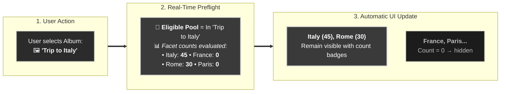
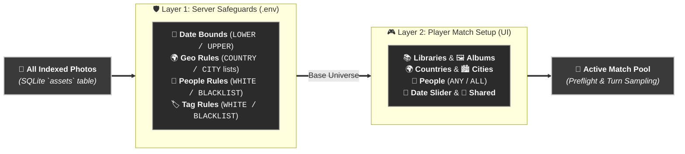
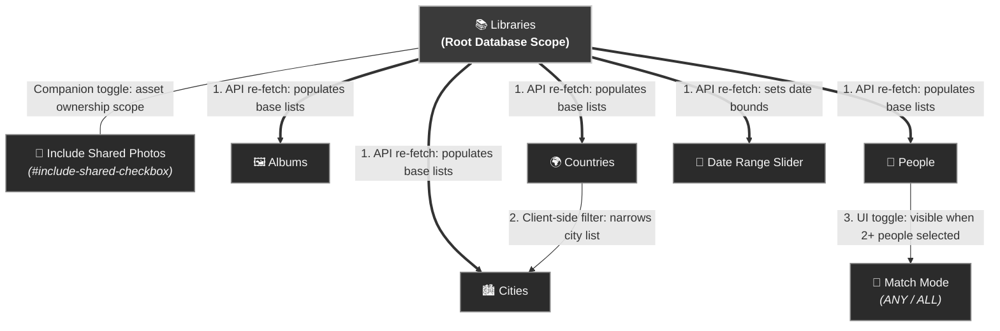
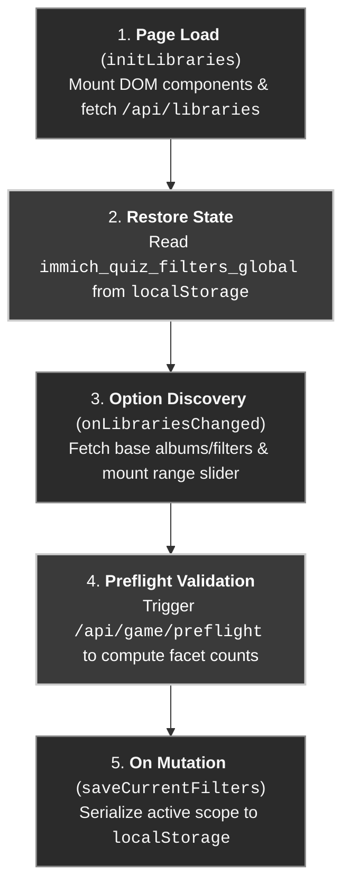

# Library & Photo Filters Architecture (`docs/FILTERS.md`)

This document provides a comprehensive technical guide to the **Library & Photo Filters** engine in **Immich Quiz**: the two-layer evaluation architecture, dynamic faceted search mechanics, structural filter hierarchies, preflight validation lifecycle, and state persistence.

---

## 1. Overview & Core Mental Model

Filters in Immich Quiz operate as a **Real-Time Dynamic Faceted Search Engine** (similar to modern e-commerce product catalogs).

Instead of a rigid one-way navigation tree where selecting one category locks out all others, **all active filter dimensions simultaneously narrow a single central candidate photo pool**. When the pool shrinks, the server recalculates option counts, and options with **0 matching photos are automatically hidden** to prevent dead-end configurations.



---

## 2. Two-Layer Filter Evaluation Architecture

Photo filtering evaluates across two successive layers: **Server Configuration Safeguards** (Layer 1) and **Player Match Setup** (Layer 2).



### 2.1 Layer Comparison Matrix

| Dimension | Layer 1: Server Safeguards (`.env` / `AppSettings`) | Layer 2: Player Filters (`PhotoFilterScope` / UI) |
|---|---|---|
| **Scope** | Server-wide policy enforced on all queries. Cannot be bypassed by players. | Interactive match options selected per match session. |
| **Data Model** | Defined in `src/config.py` (`AppSettings`) and compiled into `AssetFilterCriteria`. | Defined in `src/models.py` (`PhotoFilterScope`, `GameSetupRequest`). |
| **Date Bounds** | `DATE_LOWER_BOUND`, `DATE_UPPER_BOUND` clamp slider min/max bounds. | `min_month`, `max_month` selected via interactive timeline slider. |
| **Countries** | `COUNTRY_WHITELIST` / `COUNTRY_BLACKLIST` prune options & baseline pool. | Player selects specific countries from multi-select dropdown. |
| **Cities** | `CITY_WHITELIST` / `CITY_BLACKLIST` prune options & baseline pool. | Player selects specific cities from multi-select dropdown. |
| **People** | `PEOPLE_WHITELIST` / `PEOPLE_BLACKLIST` exclude unauthorized individuals. | Player selects specific people and matching mode (`ANY` vs `ALL`). |
| **Tags** | `TAG_WHITELIST` (requires tag) / `TAG_BLACKLIST` (excludes tagged photos). | Applied at server level across all game queries. |
| **Ownership** | N/A | `include_shared` checkbox (`#include-shared-checkbox`) includes/excludes shared & partner assets. |

### 2.2 Compilation Bridge (`AssetFilterCriteria`)

Before executing any database search, preflight check, or asset sampling, the server fuses Layer 1 and Layer 2 using `AssetFilterCriteria.from_setup(setup, settings)`:

1. **Option Discovery (`GET /api/filters`)**: Returns only countries, cities, people, and date boundaries that pass Layer 1 safeguards for the selected libraries.
2. **SQL Query Engine (`MetadataStore._build_filter_clauses`)**: Generates optimized SQL using `EXISTS` / `NOT EXISTS` subqueries to enforce both safeguard rules and user filters simultaneously in **< 3ms**.
3. **In-Memory Fallback (`ImmichClient.is_eligible_asset`)**: Mirrors the identical multi-layer logic for live Immich API queries.

---

## 3. Structural Hierarchy & Inter-Filter Rules

Beyond general faceted search, four explicit **structural rules** govern the relationship between filter controls:



### The 4 Structural Rules:

1. **`Libraries` as Root Scope**:
   - Changing library selections invalidates the current filter universe and triggers `GET /api/albums` and `GET /api/filters`.
   - Rebuilds base option lists for albums, countries, cities, people, and timeline bounds.
2. **`Countries` $\to$ `Cities` Client-Side Cascading**:
   - Selecting one or more countries immediately restricts the visible city dropdown to cities belonging to those countries.
   - Any previously selected city outside the chosen countries is automatically pruned.
3. **`People` $\to$ `ANY / ALL` Match Mode Toggle**:
   - Selecting **2 or more people** reveals the match mode toggle button.
   - **`ANY` (Union)**: Returns photos containing *at least one* of the selected people (`OR` logic).
   - **`ALL` (Intersection)**: Returns only photos containing *all* selected people simultaneously (`AND` logic).
   - Selecting 0 or 1 person hides the toggle and defaults to `ANY`.
4. **`Include Shared Photos` Scope (`#include-shared-checkbox`)**:
   - Positioned beneath the library multi-select as a toggle pill (`#label-include-shared` wrapping `#include-shared-checkbox`).
   - **Default (`false` / unchecked)**: Queries strictly filter out shared and partner assets (`is_shared = 0 AND is_partner = 0`) and exclude photos belonging to shared albums (when no specific albums are selected).
   - **Active (`true` / checked)**: Expands the candidate asset pool to include shared/partner assets and shared albums.
   - When specific albums are chosen in `Albums`, the pool directly includes photos from those selected albums regardless of the global shared toggle.
5. **Cross-Library Entity Deduplication & Dual Resolution**:
   - In multi-library setups, people and albums are **deduplicated by name** (`GROUP BY name COLLATE NOCASE`) in dropdowns so users see clean, unique choices without duplicate entries.
   - The query and filtering engines support **dual matching** by both exact UUIDs (`p-1`, `alb-1`) and display names (`"Alice"`, `"Trip 2023"`).
   - In `PeopleMode.ALL`, cross-library photos match when all distinct selected people are present, resolving names across libraries rather than requiring conflicting disjoint UUIDs.

---

## 4. Real-Time Preflight Validation Loop

Every filter change triggers a debounced (500ms) background request to `POST /api/game/preflight` to validate photo pool eligibility and fetch updated facet counts.

### 4.1 Preflight Response Schema

```json
{
  "ok": true,
  "eligible_count": 450,
  "required": 10,
  "active_filters": ["location", "date", "albums"],
  "min_date": "2022-01-01",
  "max_date": "2024-12-31",
  "total_count": 1200,
  "gps_count": 850,
  "date_count": 1150,
  "location_mode": true,
  "date_mode": true,
  "facet_counts": {
    "countries": { "Italy": 120, "Japan": 85, "France": 0 },
    "cities": { "Rome": 80, "Florence": 40, "Tokyo": 85 },
    "people": { "Alice": 55, "Bob": 32 },
    "albums": { "Summer 2024": 150 }
  },
  "is_synced": true,
  "sync_status": "idle"
}
```

### 4.2 Faceted UI Mechanics

* **Count Badges**: Dropdown options display real-time eligible photo counts (e.g. `Rome (80)`).
* **Zero-Match Suppression**: Options with `count === 0` are hidden from dropdown lists to prevent invalid filter combinations, unless they are currently selected by the player.
* **Start Game Gate**: The "Start Match" button is disabled whenever `eligible_count < required` or when no synced assets exist.

---

## 5. Persistence & Setup Lifecycle

Filter state follows a managed lifecycle across page loads and sessions:



### 5.1 Serialized State Format (`localStorage`)

```json
{
  "libraries": ["Personal"],
  "album_ids": ["uuid-1"],
  "countries": ["Italy"],
  "cities": ["Rome"],
  "person_ids": ["person-uuid-2"],
  "people_mode": "ALL",
  "min_month": "2022-01",
  "max_month": "2024-12",
  "include_shared": false
}
```

### 5.2 Reset Filters Action (`#reset-filters-btn`)

Clicking the **Reset Filters** button:
1. Clears selections on all `MultiSelect` instances (Albums, Countries, Cities, People).
2. Resets the date slider to full available timeline bounds.
3. Unchecks the `#include-shared-checkbox` (removing the `.active` styling from `#label-include-shared`) and resets `people_mode` to `"ANY"`.
4. Clears the persisted `localStorage` key.
5. Re-runs `onLibrariesChanged()` to re-discover base options and trigger fresh preflight counts.

---

## 6. Summary Formatting & Leaderboard Tooltips

Active filter parameters are compiled into localized, human-readable summary badges and tooltips for display on match summaries and the persistent leaderboard:

* **Short Summary (`GameFilterConfig.format_filter_summary`)**: Displays up to 2 items per active dimension or a condensed count (e.g. `Trip to Italy • 2 Countries • 2022/01 - 2024/12 • Shared Photos`). Defaults to `Full Library` when no custom filters are active.
* **Detailed Tooltip (`GameFilterConfig.format_filter_tooltip`)**: Generates a multiline breakdown listing exact libraries, album names, country names, city names, person names (with `ANY`/`ALL` indicator), date spans, and shared photos status (`Shared: Yes`) for detailed inspection.
