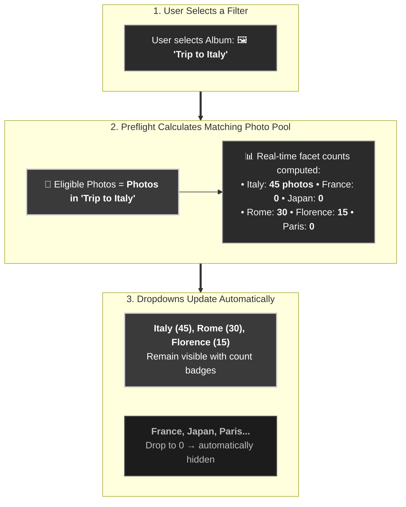
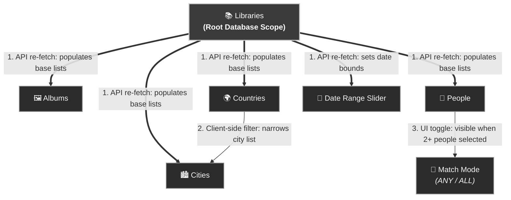

# Library & Photo Filters Architecture (`docs/FILTERS.md`)

This document details the **Library & Photo Filters** system in **Immich Quiz**: how filter selections influence each other, the real-time faceted feedback loop, and state persistence.

---

## 1. The Core Mental Model: Dynamic Faceted Search

Filters in Immich Quiz operate as a **Faceted Search Engine** (similar to e-commerce product filters). 

Instead of a simple one-way tree, **all active filters simultaneously narrow a single central photo pool**. When the pool shrinks, the backend recalculates which options still have photos, and any option with **0 photos is hidden** from its dropdown.



---

## 2. Structural Hierarchy & Hard Links

Beyond dynamic faceted search, three specific **structural relationships** exist:



### The 3 Structural Rules:
1. **`Libraries` is the Root Scope**: Changing selected libraries triggers network requests (`GET /api/albums` and `GET /api/filters`) to rebuild the base universe of albums, countries, cities, people, and timeline bounds.
2. **`Countries` $\rightarrow$ `Cities` Client-Side Sub-Scoping**: Selecting countries immediately filters the in-memory city list so you only see cities within those countries, and prunes any selected cities that no longer match.
3. **`People` $\rightarrow$ `ANY / ALL` Toggle**: Selecting 2 or more people reveals the match mode toggle button; selecting 0 or 1 person hides it.

---

## 3. Real-Time Preflight Response Schema

Every filter change sends a debounced (500ms) request to `POST /api/game/preflight` and returns real-time facet counts:

### Facet Counts Response Example
```json
{
  "ok": true,
  "eligible_count": 450,
  "required": 10,
  "facet_counts": {
    "countries": { "Italy": 120, "Japan": 85, "France": 0 },
    "cities": { "Rome": 80, "Florence": 40, "Tokyo": 85 },
    "people": { "Alice": 55, "Bob": 32 },
    "albums": { "Summer 2024": 150 }
  }
}
```

- Each `MultiSelect` component receives its count map via `multiSelect.updateCounts(...)`.
- Non-zero items show count badges, e.g. `Rome (80)`.
- **Zero-match suppression**: Items with `count === 0` are excluded from dropdown option lists unless already selected.

---

## 4. Persistence & Lifecycle

1. **Initial Load (`initLibraries()`)**:
   - Mounts DOM components and event listeners.
   - Fetches available libraries via `/api/libraries`.
   - Restores saved filter state from `localStorage` (`immich_quiz_filters_global`).
   - Executes `onLibrariesChanged()` to populate options and trigger initial preflight validation.
2. **State Persistence (`saveCurrentFilters()`)**:
   - Every filter mutation serializes active selections to `localStorage`:
     ```json
     {
       "libraries": ["Personal"],
       "album_ids": ["uuid-1"],
       "countries": ["Italy"],
       "cities": ["Rome"],
       "person_ids": ["person-uuid-2"],
       "people_mode": "ALL",
       "min_month": "2022-01",
       "max_month": "2024-12",
       "include_shared": false
     }
     ```
3. **Reset Filters (`#reset-filters-btn`)**:
   - Clears all MultiSelect selections, resets the date slider, unchecks photo source checkboxes, resets people mode to `"ANY"`, removes `localStorage` keys, and re-triggers `onLibrariesChanged()`.
