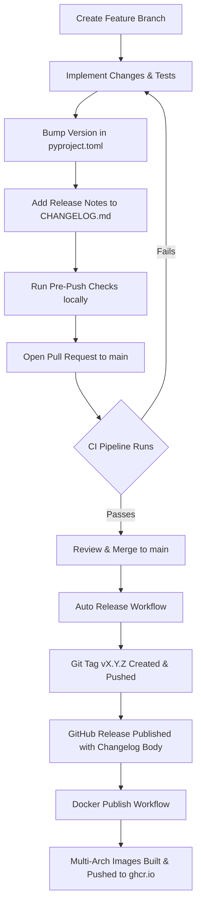

# Release & CI/CD Guidelines

This guide details the release workflow, versioning strategy, CI/CD pipelines, and local verification procedures for **Immich Quiz**.

---

## 1. Core Principles & Philosophy

1. **Single Source of Truth**:
   The authoritative version number is defined in [`pyproject.toml`](../pyproject.toml) under `[project].version`.
   All runtime components ([`src/version.py`](../src/version.py), `/api/health`, `/api/ui-config`, HTML templates, and the Service Worker cache `sw.js`) dynamically derive their version from `pyproject.toml`.

2. **Strict Semantic Versioning**:
   Releases adhere to [SemVer 2.0.0](https://semver.org/spec/v2.0.0.html) (`MAJOR.MINOR.PATCH`):
   - **`MAJOR`**: Incompatible architectural overhauls, database schema migrations without backward compatibility, or breaking REST/WebSocket API contracts (e.g. `2.0.0`, `3.0.0`).
   - **`MINOR`**: New features, game modes, UI dashboards, or settings that remain backward compatible (e.g. `2.5.0`, `3.1.0`).
   - **`PATCH`**: Backward-compatible bug fixes, performance optimizations, translation updates, or UI polish (e.g. `3.0.1`).
   - **Pre-releases** (e.g. `3.0.0rc1`): Reserved exclusively for staging/testing branches (`rc` or `release/*`). Pre-release suffixes are **strictly prohibited on `main`**.

3. **Changelog-Driven Releases**:
   Every release requires documented notes in [`CHANGELOG.md`](../CHANGELOG.md) formatted according to [Keep a Changelog](https://keepachangelog.com/en/1.0.0/). The CI pipeline enforces that any pull request containing code changes includes a matching version section in `CHANGELOG.md`.

4. **Trunk-Based Automated Releases**:
   Merging a PR with a version bump into `main` automatically creates an annotated Git tag, cuts a GitHub Release with extracted changelog notes, and publishes multi-architecture Docker container images.

---

## 2. End-to-End Release Lifecycle



### Step 1: Create a Feature or Fix Branch

Always branch off the latest `main`:

```bash
git checkout main
git pull origin main
git checkout -b feat/my-new-feature
```

### Step 2: Implement Changes and Tests

- Ensure new features or bug fixes have corresponding automated tests in `tests/`.
- Ensure code adheres to configured formatters (`ruff format`) and linters (`ruff check`).
- Ensure type annotations pass `mypy src`.

### Step 3: Bump Version in `pyproject.toml`

Update the version string in [`pyproject.toml`](../pyproject.toml):

```toml
[project]
name = "immich-quiz"
version = "3.1.0"
```

### Step 4: Document Changes in `CHANGELOG.md`

Add a new release section right under the document preamble in [`CHANGELOG.md`](../CHANGELOG.md):

```markdown
## [3.1.0] - 2026-09-08

### Added
- Feature description here...

### Changed
- Refactored component details...

### Fixed
- Bug fix description...
```

Use standardized subsection headers: `Added`, `Changed`, `Deprecated`, `Removed`, `Fixed`, `Security`.

### Step 5: Verify Locally Before Pushing

Run the automated pre-push checks (or verify them manually):

```bash
# 1. Format check
uv run ruff format --check

# 2. Lint check
uv run ruff check .

# 3. Type check
uv run mypy src

# 4. Run test suite with coverage
uv run pytest --cov=src --cov-report=term-missing
```

### Step 6: Open Pull Request to `main`

Push your branch and open a PR targeting `main`.
The CI workflow automatically executes:

- Quality and test suites across all components.
- **Version Bump Gate**: Checks if code files were modified. If yes, verifies that `version` in `pyproject.toml` is greater than `origin/main` and that a corresponding release section exists in `CHANGELOG.md`.

### Step 7: Merge PR to `main`

Once CI passes and the PR is approved, merge it.

### Step 8: Automated Release & Container Deployment

Upon merge to `main`:

1. **`release.yml`** triggers:
   - Validates the version format (`X.Y.Z`).
   - Checks if release tag `vX.Y.Z` already exists.
   - Extracts the release section from `CHANGELOG.md`.
   - Creates and pushes annotated Git tag `vX.Y.Z`.
   - Publishes the GitHub Release with the extracted changelog notes.
2. **`docker-publish.yml`** triggers on release:
   - Sets up QEMU and Docker Buildx.
   - Builds multi-architecture images for `linux/amd64` and `linux/arm64`.
   - Pushes images to GitHub Container Registry (`ghcr.io/rafaelsavi/immich-quiz`) with tags:
     - `:latest` (pointing to the latest official release)
     - `:vX.Y.Z` (e.g. `:v3.1.0`)
     - `:X.Y.Z` (e.g. `:3.1.0`)
     - `:sha-<commit>`

---

## 3. GitHub Actions Workflows Breakdown

### 3.1 CI Workflow (`.github/workflows/ci.yml`)

- **Triggers**: Pull requests targeting `main`, pushes to `main`.
- **Key Responsibilities**:
  1. Setup Python environment using `astral-sh/setup-uv` with caching.
  2. Install headless Chromium browser for Playwright end-to-end tests (`uv run playwright install --with-deps chromium`).
  3. Validate formatting (`uv run ruff format --check`).
  4. Run static linting (`uv run ruff check .`).
  5. Run static type checking (`uv run mypy src`).
  6. Execute unit, integration, and E2E tests with coverage report (`uv run pytest --cov=src`).
  7. **Version Bump Check (PRs only)**:
     - Detects code changes comparing against the merge-base (`git diff origin/main...HEAD`).
     - Bypasses check if changes only affect markdown files, documentation (`docs/**`), VS Code configs (`.vscode/**`), or hooks (`.githooks/**`).
     - Verifies `pyproject.toml` version is strictly bumped using semantic version comparison.
     - Rejects pre-release suffixes (`rc`, `beta`, `dev`) targeting `main`.
     - Confirms matching header entry `## [X.Y.Z]` exists in `CHANGELOG.md`.

### 3.2 Auto Release Workflow (`.github/workflows/release.yml`)

- **Triggers**: Pushes to `main` (and staging branches `rc`, `release/**`).
- **Permissions**: `contents: write`.
- **Key Responsibilities**:
  1. Extracts version from `pyproject.toml`.
  2. Verifies the tag does not already exist via GitHub CLI (`gh release view`).
  3. Extracts release notes directly from `CHANGELOG.md` for that version.
  4. Creates and pushes the annotated tag `vX.Y.Z`.
  5. Publishes a GitHub Release containing the changelog body, setting `make_latest: true` for stable releases.

### 3.3 Docker Publish Workflow (`.github/workflows/docker-publish.yml`)

- **Triggers**: Release published (`release: [published]`), manual trigger (`workflow_dispatch`).
- **Permissions**: `contents: read`, `packages: write`.
- **Key Responsibilities**:
  1. Logs into GitHub Container Registry (`ghcr.io`).
  2. Provisions QEMU and Docker Buildx.
  3. Builds multi-architecture images for `linux/amd64,linux/arm64`.
  4. Applies layer caching using GitHub Actions cache (`type=gha`).
  5. Generates tags (`:latest`, `:vX.Y.Z`, `:X.Y.Z`, `:sha`) and pushes to `ghcr.io`.

---

## 4. Local Git Pre-Push Hook

To catch lint, formatting, type, and test regressions before pushing to remote, install the project's pre-push hook:

```bash
# Enable repository hooks directory
git config core.hooksPath .githooks
```

The hook automatically runs:

1. `uv sync --extra dev`
2. `uv run playwright install chromium`
3. `uv run ruff check .`
4. `uv run ruff format --check`
5. `uv run mypy src`
6. `uv run pytest --cov=src --cov-report=term-missing`

If any step fails, the push is aborted.

---

## 5. Troubleshooting Common CI & Release Issues

### Error: *"Code changes detected but version in pyproject.toml has not been updated!"*

- **Cause**: Code files under `src/`, `static/`, `locales/`, or `tests/` were modified in the PR without bumping `version` in `pyproject.toml`.
- **Solution**: Increment the version in `pyproject.toml` (e.g. `3.0.0` -> `3.0.1`) and add the corresponding release entry in `CHANGELOG.md`.
- **Note**: If your PR strictly updates documentation (`docs/**` or `*.md`), the version check is skipped automatically.

### Error: *"Version 'X.Y.Z' from pyproject.toml was not found in CHANGELOG.md!"*

- **Cause**: The version in `pyproject.toml` was bumped, but `CHANGELOG.md` lacks a corresponding `## [X.Y.Z]` header.
- **Solution**: Add `## [X.Y.Z] - YYYY-MM-DD` at the top of `CHANGELOG.md` with sections summarizing your changes.

### Error: *"Releases on main branch must follow strict x.x.x layout"*

- **Cause**: A pre-release tag like `3.0.0rc1` was pushed or targeted to `main`.
- **Solution**: Pre-releases are only allowed on `rc` or `release/*` branches. For `main`, use standard `MAJOR.MINOR.PATCH` format (e.g. `3.0.0`).

### Error: *"Failed to push tag vX.Y.Z"* in `release.yml`

- **Cause**: GitHub repository rulesets or branch/tag protection policies prevent the default `GITHUB_TOKEN` from pushing tags directly.
- **Solution**: Ensure repository Settings > Actions > General > Workflow Permissions has **Read and write permissions** enabled, or configure a personal access token (`RELEASE_TOKEN`) with `repo` scope in repository secrets.
