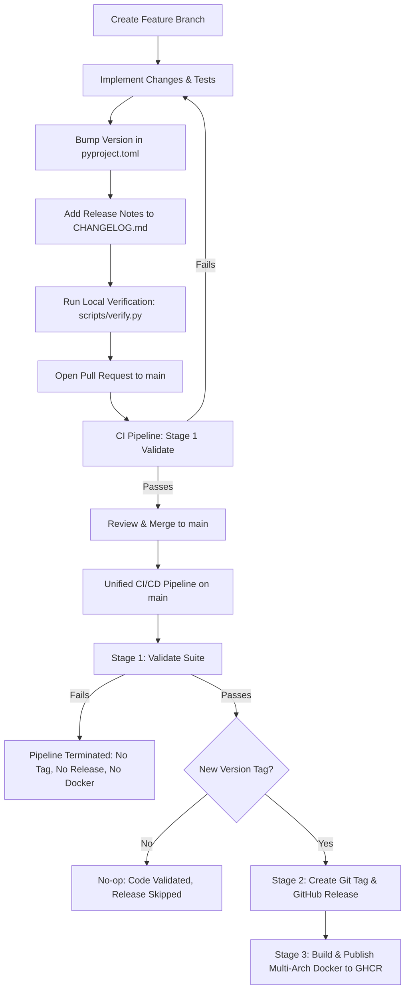

# Release & CI/CD Guidelines

This guide details the release workflow, versioning strategy, CI/CD pipelines, and local verification procedures for **Immich Quiz**.

---

## 1. Core Principles & Philosophy

1. **Single Source of Truth**:
   The authoritative version number is defined in [`pyproject.toml`](../pyproject.toml) under `[project].version`.
   All runtime components ([`src/version.py`](../src/version.py), `/api/health`, `/api/ui-config`, HTML templates, and the Service Worker cache `sw.js`) dynamically derive their version from `pyproject.toml`.

2. **Strict Semantic Versioning**:
   Releases adhere to [SemVer 2.0.0](https://semver.org/spec/v2.0.0.html) (`MAJOR.MINOR.PATCH`):
   - **`MAJOR`**: Incompatible architectural overhauls, database schema migrations without backward compatibility, or breaking REST/WebSocket API contracts (e.g. `2.0.0`, `3.0.0`).
   - **`MINOR`**: New features, game modes, UI dashboards, or settings that remain backward compatible (e.g. `2.5.0`, `3.1.0`).
   - **`PATCH`**: Backward-compatible bug fixes, performance optimizations, translation updates, or UI polish (e.g. `3.0.1`).
   - **Pre-releases** (e.g. `3.0.0rc1`): Reserved exclusively for staging/testing branches (`rc` or `release/*`). Pre-release suffixes are **strictly prohibited on `main`**.

3. **Changelog-Driven Releases**:
   Every release requires documented notes in [`CHANGELOG.md`](../CHANGELOG.md) formatted according to [Keep a Changelog](https://keepachangelog.com/en/1.0.0/). The CI pipeline enforces that any pull request containing code changes includes a matching version section in `CHANGELOG.md`.

4. **Trunk-Based Automated Releases**:
   Merging a PR with a version bump into `main` automatically creates an annotated Git tag, cuts a GitHub Release with extracted changelog notes, and publishes multi-architecture Docker container images.

---

## 2. End-to-End Release Lifecycle



### Step 1: Create a Feature or Fix Branch

Always branch off the latest `main`:

```bash
git checkout main
git pull origin main
git checkout -b feat/my-new-feature
```

### Step 2: Implement Changes and Tests

- Ensure new features or bug fixes have corresponding automated tests in `tests/`.
- Ensure code adheres to configured formatters (`ruff format`) and linters (`ruff check`).
- Ensure type annotations pass `mypy src`.

### Step 3: Bump Version in `pyproject.toml`

Update the version string in [`pyproject.toml`](../pyproject.toml):

```toml
[project]
name = "immich-quiz"
version = "3.1.0"
```

### Step 4: Document Changes in `CHANGELOG.md`

Add a new release section right under the document preamble in [`CHANGELOG.md`](../CHANGELOG.md):

```markdown
## [3.1.0] - 2026-09-10

### Added
- Feature description here...

### Changed
- Refactored component details...

### Fixed
- Bug fix description...
```

Use standardized subsection headers: `Added`, `Changed`, `Deprecated`, `Removed`, `Fixed`, `Security`.

### Step 5: Verify Locally Before Pushing (Identical to CI)

Run the unified verification script:

```bash
# Full verification (Format, Lint, Types, Tests, and Version/Changelog checks)
uv run python scripts/verify.py --check-version

# Tip: Auto-fix formatting and linting errors automatically:
uv run python scripts/verify.py --fix
```

### Step 6: Open Pull Request to `main`

Push your branch and open a PR targeting `main`.
The CI workflow automatically executes **Stage 1 (`validate`)**:

- Quality and test suites across all components.
- **Version Bump Gate**: Checks if code files were modified. If yes, verifies that `version` in `pyproject.toml` is strictly greater than `origin/main` and that a corresponding non-empty release section exists in `CHANGELOG.md`.

### Step 7: Merge PR to `main`

Once validation passes and the PR is approved, merge it.

### Step 8: Strict Sequential Pipeline Execution

Upon merge to `main`, the single unified **`CI/CD Pipeline`** executes in strict sequential order:

1. **Stage 1 (`validate`)**:
   - Executes the exact same `scripts/verify.py --ci` suite.
   - **Critical Guardrail**: If ANY test, lint, format, or type check fails, the pipeline aborts immediately. **Stages 2 and 3 will never run.**
   - Evaluates whether `version` represents a new tag not yet present on remote.

2. **Stage 2 (`release`)** *(Depends on `validate`)*:
   - Runs **only** if Stage 1 completely passed and a new version is detected.
   - Extracts release notes directly from `CHANGELOG.md` for that version.
   - Creates and pushes the annotated Git tag `vX.Y.Z`.
   - Publishes the GitHub Release with the extracted changelog notes.

3. **Stage 3 (`docker`)** *(Depends on `release`)*:
   - Runs **only** if Stage 2 successfully created the release.
   - Provisions QEMU and Docker Buildx.
   - Builds multi-architecture container images for `linux/amd64` and `linux/arm64`.
   - Pushes images to GitHub Container Registry (`ghcr.io/rafaelsavi/immich-quiz`) with tags:
     - `:latest` (pointing to the latest official release)
     - `:vX.Y.Z` (e.g. `:v3.1.0`)
     - `:X.Y.Z` (e.g. `:3.1.0`)
     - `:sha-<commit>`

---

## 3. GitHub Actions Workflows Breakdown

### 3.1 Unified CI/CD Pipeline (`.github/workflows/ci.yml`)

- **Triggers**: Pull requests targeting `main`, pushes to `main`, and manual triggers.
- **Permissions**: `contents: write`, `packages: write`.
- **Sequential Architecture**:
  - `validate`: Runs on all branches/PRs. Runs `uv run python scripts/verify.py --ci`.
  - `release`: Depends on `validate`. Runs only on `main` when a new version tag is detected.
  - `docker`: Depends on `release`. Builds and pushes multi-arch images (`linux/amd64`, `linux/arm64`) to `ghcr.io`.

### 3.2 Standalone Docker Publish Workflow (`.github/workflows/docker-publish.yml`)

- **Triggers**: Manual trigger (`workflow_dispatch`).
- **Permissions**: `contents: read`, `packages: write`.
- **Purpose**: Serves as an on-demand utility to manually rebuild and push Docker container images from any branch at any time without triggering a release.

---

## 4. Local Git Pre-Push Hook

To catch all issues before pushing to remote, enable the project's pre-push hook:

```bash
# Enable repository hooks directory
git config core.hooksPath .githooks
```

The hook automatically executes:

```bash
uv sync --extra dev
uv run playwright install chromium
uv run python scripts/verify.py --check-version
```

If any check fails, the push is prevented, guaranteeing 100% parity with cloud CI.

---

## 5. Troubleshooting Common CI & Release Issues

### Error: *"Code changes detected but version in pyproject.toml has not been updated!"*

- **Cause**: Code files under `src/`, `static/`, `locales/`, or `tests/` were modified in the PR without bumping `version` in `pyproject.toml`.
- **Solution**: Increment the version in `pyproject.toml` (e.g. `3.0.0` -> `3.0.1`) and add the corresponding release entry in `CHANGELOG.md`.
- **Note**: If your PR strictly updates documentation (`docs/**` or `*.md`), the version check is skipped automatically.

### Error: *"Version 'X.Y.Z' from pyproject.toml was not found in CHANGELOG.md!"*

- **Cause**: The version in `pyproject.toml` was bumped, but `CHANGELOG.md` lacks a corresponding `## [X.Y.Z]` header.
- **Solution**: Add `## [X.Y.Z] - YYYY-MM-DD` at the top of `CHANGELOG.md` with sections summarizing your changes.

### Error: *"Releases on main branch must follow strict x.x.x layout"*

- **Cause**: A pre-release tag like `3.0.0rc1` was pushed or targeted to `main`.
- **Solution**: Pre-releases are only allowed on `rc` or `release/*` branches. For `main`, use standard `MAJOR.MINOR.PATCH` format (e.g. `3.0.0`).

### Error: *"Failed to push tag vX.Y.Z"*

- **Cause**: GitHub repository rulesets or branch/tag protection policies prevent the default `GITHUB_TOKEN` from pushing tags directly.
- **Solution**: Ensure repository Settings > Actions > General > Workflow Permissions has **Read and write permissions** enabled, or configure a personal access token (`RELEASE_TOKEN`) with `repo` scope in repository secrets.
