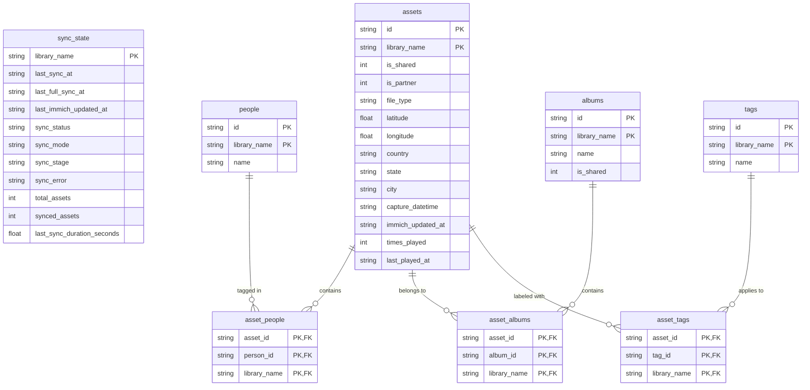
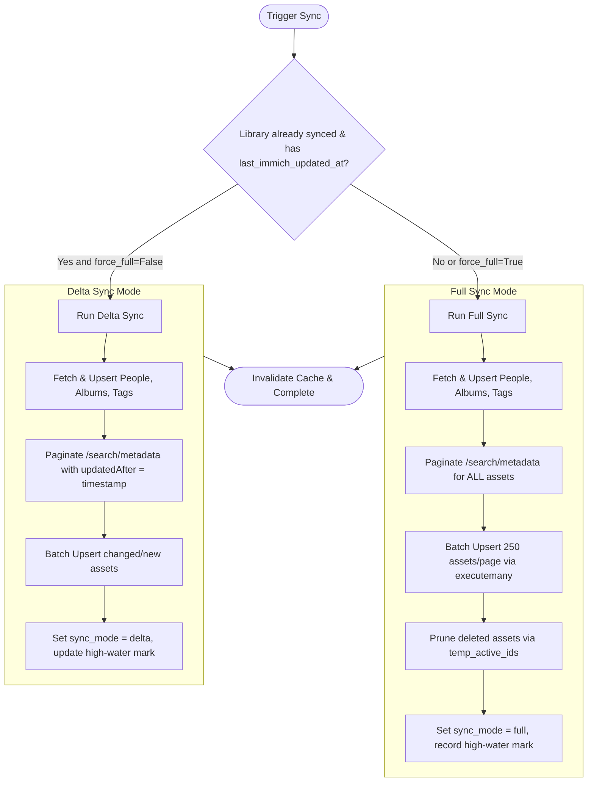
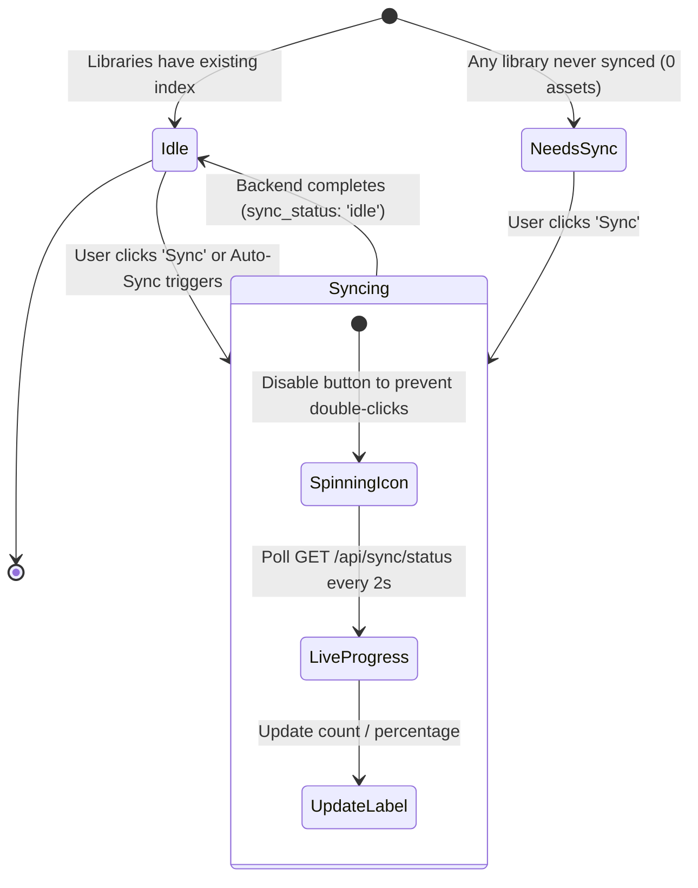

# Metadata Synchronization & Storage Engine (`docs/SYNC.md`)

This document provides a comprehensive guide to the **Metadata Synchronization Engine** in **Immich Quiz**. It details the architecture, database schema, synchronization modes (Full vs. Delta), background scheduling, API integration, and performance characteristics.

---

## 1. Overview & Purpose

Immich Quiz indexes photo metadata into a local, high-performance SQLite database (`data/metadata.db`).

### Why Local Metadata Indexing?

* **Instant Candidate Selection**: Evaluates complex filter combinations (e.g. date ranges, countries, cities, people inclusion/exclusion, album subsets, play history) in **< 5 milliseconds**, even on libraries with **100,000+ photos**.
* **Zero Immich Server Load During Gameplay**: Immich is only queried for thumbnail images during active rounds; all quiz logic, diversity checks, and question generation run locally against SQLite.
* **Resilience & Offline Caching**: Quiz gameplay remains fully operational even if network latency between the quiz container and Immich fluctuates.

---

## 2. Synchronization Architecture

```
                               ┌────────────────────────────────┐
                               │       Immich REST API          │
                               └──────┬──────────────────┬──────┘
                                      │                  │
                         GET /people  │                  │  POST /search/metadata
                         GET /albums  │                  │  (withTags, withExif,
                         GET /tags    │                  │   updatedAfter)
                                      ▼                  ▼
┌────────────────────────────────────────────────────────────────────────┐
│                        SyncEngine (src/storage/sync.py)                │
│                                                                        │
│  - Task deduplication & concurrency control                            │
│  - Non-blocking async event loop yielding (0.01s per batch)            │
│  - Mode determination: Full Sync vs. Incremental Delta Sync            │
│  - Filter cache invalidation trigger on completion                     │
└───────────────────────────────────┬────────────────────────────────────┘
                                    │
                                    │ Batch Upserts (executemany)
                                    ▼
┌────────────────────────────────────────────────────────────────────────┐
│                      MetadataStore (src/storage/metadata.py)           │
│                                                                        │
│   SQLite Database (data/metadata.db - WAL Mode, Foreign Keys = ON)     │
│   ├── sync_state         (Tracking, timestamps, sync mode, duration)   │
│   ├── assets             (EXIF, lat/lon, country, state, city, dates)  │
│   ├── people             (Named person entities)                       │
│   ├── asset_people       (Asset <-> Person junction)                   │
│   ├── albums             (Album names, shared flags)                   │
│   ├── asset_albums       (Asset <-> Album junction)                    │
│   ├── tags               (Custom user tags)                            │
│   └── asset_tags         (Asset <-> Tag junction)                      │
└────────────────────────────────────────────────────────────────────────┘
```

---

## 3. Database Schema (`metadata.db`)

The SQLite database is initialized with **Write-Ahead Logging (WAL)** mode, foreign keys enabled (`PRAGMA foreign_keys = ON`), and indexed query paths:

### 3.1 Tables & Relationships

| Table Name         | Primary Key                           | Description                                                                                                                                                        |
|:-------------------|:--------------------------------------|:-------------------------------------------------------------------------------------------------------------------------------------------------------------------|
| **`sync_state`**   | `library_name`                        | Telemetry, status (`SyncStatus`), `sync_mode` (`SyncMode`), `sync_stage` (`SyncStage`), `last_immich_updated_at` (high-water mark), and duration per library.       |
| **`assets`**       | `(id, library_name)`                  | Core asset metadata (`file_type`, `latitude`, `longitude`, `country`, `state`, `city`, `capture_datetime`, `immich_updated_at`, `times_played`, `last_played_at`). |
| **`people`**       | `(id, library_name)`                  | People discovered in Immich (`library_name`, `name`). Hidden faces are automatically excluded.                                                                     |
| **`asset_people`** | `(asset_id, person_id, library_name)` | Junction table mapping assets to tagged individuals (`ON DELETE CASCADE`).                                                                                         |
| **`albums`**       | `(id, library_name)`                  | Albums in Immich (`library_name`, `name`, `is_shared`).                                                                                                            |
| **`asset_albums`** | `(asset_id, album_id, library_name)`  | Junction table mapping assets to album memberships (`ON DELETE CASCADE`).                                                                                          |
| **`tags`**         | `(id, library_name)`                  | Immich custom tags (`library_name`, `name`).                                                                                                                       |
| **`asset_tags`**   | `(asset_id, tag_id, library_name)`    | Junction table mapping assets to tags (`ON DELETE CASCADE`).                                                                                                       |

### 3.2 Schema Diagram



---

## 4. Synchronization Modes

The sync engine operates in two modes: **Full Sync** and **Incremental Delta Sync**.



### 4.1 Full Synchronization (`SyncMode.full`)

* **When Executed**:
  * On initial setup when the database has no synced assets.
  * When explicitly triggered via API with `force_full=true`.
* **Workflow**:
  1. **Auxiliary Entities**: Fetches and upserts `people` (`GET /people`) and `tags` (`GET /tags`).
  2. **High-Concurrency Album Ingestion**: Fetches album metadata (`GET /albums`) and retrieves album asset memberships **in parallel** (`asyncio.gather` with a bounded concurrency pool of 15). Empty albums (`assetCount == 0`) are skipped automatically. Prunes deleted albums from SQLite.
  3. **Full Asset Pagination**: Queries `POST /search/metadata` page-by-page (page size `250`) requesting `withExif: True`, `withPeople: True`, `withTags: True`, `withPartners: True`, and `isShared: True`.
  4. **Batch Upserts**: Uses SQLite `executemany` to insert/update `assets` and reconcile junction tables. Stale junction records for the batch are cleared and repopulated atomically.
  5. **Deletion Pruning (`prune_missing_assets`)**: Inserts all active asset IDs into a SQLite `TEMP TABLE temp_active_ids` and deletes records present in SQLite but missing on the server.
  6. **Telemetry**: Sets `sync_status = idle`, `sync_mode = full`, records `last_full_sync_at`, `last_immich_updated_at` (newest `updatedAt` found), and total execution time.

### 4.2 Incremental Delta Synchronization (`SyncMode.delta`)

* **When Executed**:
  * Automatically on subsequent runs (startup or scheduled timer) when `last_immich_updated_at` is already stored in `sync_state`.
  * On manual `POST /api/sync` requests where `force_full=false`.
* **Workflow**:
  1. **Auxiliary Entities**: Refreshes `people`, `albums`, and `tags` in 1 request each.
  2. **Zero-Overhead Album Delta**: Compares each album's `updatedAt` with `last_immich_updated_at`. If no albums were modified, **zero album detail requests** are made (skipping hundreds of unnecessary HTTP calls). If an album was modified or newly created, only that album's membership is refreshed.
  3. **Incremental Asset Query**: Queries `POST /search/metadata` with `updatedAfter: <last_immich_updated_at>`. Only photos uploaded, updated (e.g. location/date edit), or tagged since the last sync are returned.
  4. **High-Speed Upsert**: Updates the modified photos in SQLite in milliseconds.
  5. **Telemetry**: Updates `last_immich_updated_at` to the newest timestamp, updates `last_sync_at`, and marks `sync_mode = delta`.

---

## 5. Automatic & Scheduled Synchronization

Synchronization is fully managed by the application lifecycle:

### 5.1 Configuration Options (`.env`)

| Variable                         | Type   | Default | Description                                                                                                                    |
|:---------------------------------|:-------|:--------|:-------------------------------------------------------------------------------------------------------------------------------|
| `AUTO_SYNC_ON_STARTUP`           | `bool` | `true`  | Automatically triggers background indexing for all configured libraries when the server starts.                                |
| `AUTO_DELTA_SYNC_INTERVAL_HOURS` | `int`  | `6`     | Interval in hours for automatic background delta syncs (`0` disables scheduled delta sync; range `0`–`8760`).                  |
| `AUTO_FULL_SYNC_INTERVAL_HOURS`  | `int`  | `120`   | Interval in hours for automatic background full syncs & deletion pruning (`0` disables scheduled full sync; range `0`–`8760`). |

### 5.2 Unified Scheduling & Single-Flight Safety

* **Database-Driven Timestamps**: A unified scheduler checks `last_sync_at` and `last_full_sync_at` from SQLite. Full sync takes precedence when due, eliminating race conditions or redundant overlapping runs between delta and full syncs.
* **Concurrency Guard**: `SyncEngine.trigger_sync` tracks running tasks per library (`_active_sync_tasks: dict[str, asyncio.Task]`). If a sync is already in progress for a given library, duplicate triggers return the existing task immediately, preventing overlapping database writes.

---

## 6. HTTP API Endpoints

### 6.1 Check Sync Status

```http
GET /api/sync/status
```

**Response (200 OK):**

```json
{
  "libraries": ["family", "personal"],
  "is_syncing": false,
  "sync_status": "idle",
  "sync_mode": "delta",
  "sync_stage": "idle",
  "last_sync_at": "2026-08-17T10:15:30.123456+00:00",
  "last_full_sync_at": "2026-08-17T08:00:00.000000+00:00",
  "last_immich_updated_at": "2026-08-17T10:14:02.000Z",
  "total_assets": 14520,
  "synced_assets": 14520,
  "last_sync_duration_seconds": 0.42,
  "sync_error": null,
  "warnings": {}
}
```

### 6.2 Trigger Sync

```http
POST /api/sync?force_full=false
```

* **Query Parameters**:
  * `force_full` (optional, default `false`): Set `true` to force a full re-scan and prune deleted photos across all configured libraries.

**Response (200 OK):**
Returns the aggregated `SyncStateResponse` object immediately while background indexing tasks execute asynchronously.

---

## 7. GUI Sync Button & User Experience

The web interface features an interactive, real-time **Sync Button** located directly beside the **Libraries** selector in the Match Setup accordion (`#sync-library-btn`).

```
┌────────────────────────────────────────────────────────┐
│  Libraries  [ ⟳ Sync (Last sync: Today, 10:15 AM) ]    │
│  [ Family Photos ✕ ] [ Personal Photos ✕ ]             │
└────────────────────────────────────────────────────────┘
```

### 7.1 Visual States & Lifecycle



| Visual State         | Button Appearance                                                      | Tooltip / Title                                                         | Behavior & User Feedback                                                                                                                                                                                                                                                     |
|:---------------------|:-----------------------------------------------------------------------|:------------------------------------------------------------------------|:-----------------------------------------------------------------------------------------------------------------------------------------------------------------------------------------------------------------------------------------------------------------------------|
| **Idle (Synced)**    | Standard button with refresh icon and label `Sync` (or `Sincronizar`). | `Sync metadata from Immich\nLast sync: Aug 17, 2026, 10:15 AM`          | Clickable at any time. Clicking initiates an incremental **Delta Sync** across all configured libraries.                                                                                                                                                                     |
| **Needs Sync**       | Glowing amber highlight with label `Sync libraries` (`.needs-sync`).   | `Libraries not yet synced. Click to sync metadata from Immich.`         | Displayed when configured libraries have 0 indexed photos. A warning banner guides the user to sync before starting a match.                                                                                                                                                 |
| **Syncing (Active)** | Continuously spinning SVG icon with animated border (`.syncing`).      | `Checking updates...` or `Scanning photos...`                           | Button is disabled to prevent duplicate concurrent triggers. Label updates with clear timeline stages (e.g. `Initializing...` → `Fetching albums...` → `Scanning photos...` → `250 / 5,000 (5%)` in Full Mode, or `Checking updates...` → `Updating (12)...` in Delta Mode). |

### 7.2 What Happens When the User Clicks "Sync"?

1. **Trigger Request**:
   * The client issues a `POST /api/sync`.
   * The GUI immediately switches the button to the `.syncing` state with stage-aware labeling (`Checking updates...` for Delta, `Initializing...` for Full).
2. **Real-Time Adaptive Polling**:
   * The browser executes an immediate check at 150ms and continues with a responsive 400ms polling interval querying `GET /api/sync/status`.
   * As the backend transitions between synchronization stages (`initializing`, `fetching_albums`, `scanning_assets`, `indexing_assets`, `checking_updates`, `updating_assets`, `pruning`, `finalizing`), the button label updates dynamically with granular progress.
3. **Automated Post-Sync Hydration (Zero-Reload Update)**:
   * As soon as `sync_status` returns to `idle`, polling terminates.
   * The GUI automatically invokes `onLibrariesChanged()`:
     * **Cache Invalidation**: Flushes the browser-side filter TTL cache.
     * **Filter Re-population**: Fetches freshly discovered **Albums**, **People**, **Countries**, and **Cities**, populating all multi-select search dropdowns.
     * **Timeline Slider Expansion**: Updates the date range slider's min/max month boundaries to include any newly uploaded photos.
     * **Preflight Re-evaluation**: Re-runs `POST /api/game/preflight` so candidate asset counts and eligibility pills update instantly without requiring a page refresh.

---

## 8. Performance & Data Integrity Guarantees

1. **Junction Table Integrity**:
   * Stale junction records (`asset_people`, `asset_albums`, `asset_tags`) are explicitly removed before re-inserting modified records.
   * Junction insertions use relational verification (`SELECT a.id, p.id FROM assets a, people p WHERE a.id = ? AND p.id = ?`), preventing orphaned references and satisfying `PRAGMA foreign_keys = ON`.
2. **Gameplay Statistics Protection**:
   * Asset re-indexing preserves player statistics (`times_played`, `last_played_at`) using SQLite `ON CONFLICT(id) DO UPDATE SET ...` clauses.
3. **Database Write Optimization**:
   * Utilizes `conn.executemany(...)` for bulk inserts and deletes, minimizing disk I/O and lock overhead.
4. **Event Loop Non-Blocking**:
   * Yields execution (`await asyncio.sleep(0.01)`) after every 250-asset batch, ensuring the web server processes quiz answers and UI requests with sub-10ms response times throughout background indexing.
