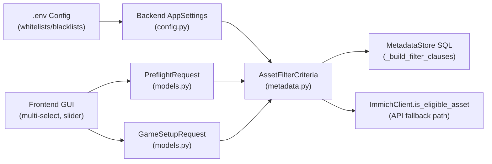

# Code Review: Filter System Since Release 1.2.1

> Reviewing commit range `145bc3df..HEAD` (46 commits, ~13 320 lines changed across 71 files).

## Executive Summary

**The filter system is in excellent shape.** All 243 tests pass, ruff and mypy report zero issues, and the architecture is clean and well-layered. I found **no bugs** — only minor hardening opportunities and a few small recommendations.

---

## Architecture Overview

The filter pipeline flows through **4 layers** end-to-end:



**Two-layer enforcement model**:
1. **Layer 1 – Server Configuration Safeguards** (always enforced): blacklists, whitelists from `.env`
2. **Layer 2 – User Match Setup Rules** (applied on top): user selections from the GUI

This dual-layer design is enforced **identically** in both:
- [`_build_filter_clauses`](file:///d:/Rafael/Projects/immich-quiz/src/storage/metadata.py#L379-L533) (SQLite indexed path)
- [`is_eligible_asset`](file:///d:/Rafael/Projects/immich-quiz/src/immich/client.py#L834-L962) (API fallback path)

---

## Correctness Analysis

### ✅ Config Loading ([`config.py`](file:///d:/Rafael/Projects/immich-quiz/src/config.py))

| Aspect | Status | Notes |
|--------|--------|-------|
| `_parse_comma_set` normalization | ✅ | Lowercases & strips; handles empty/whitespace-only |
| `country_whitelist` / `blacklist` | ✅ | Properly `frozenset[str]` |
| `city_whitelist` / `blacklist` | ✅ | Properly `frozenset[str]` |
| `people_whitelist` / `blacklist` | ✅ | Properly `frozenset[str]` |
| Date bounds validation | ✅ | Cross-validates lower ≤ upper |
| `AppSettings` immutability | ✅ | `frozen=True` dataclass |

### ✅ Pydantic Models ([`models.py`](file:///d:/Rafael/Projects/immich-quiz/src/models.py))

| Aspect | Status | Notes |
|--------|--------|-------|
| `BaseGameConfig` shared across Preflight + Setup | ✅ | Single source of truth |
| `PreflightRequest` extends `BaseGameConfig` | ✅ | Allows empty players |
| `GameSetupRequest` extends `BaseGameConfig` | ✅ | Requires ≥1 player |
| `people_mode` typing | ✅ | `Literal['OR', 'AND']` |
| `FacetCounts` model | ✅ | Country/city/people/album facets |
| `min_date` / `max_date` validator | ✅ | Cross-validated |

### ✅ AssetFilterCriteria ([`metadata.py`](file:///d:/Rafael/Projects/immich-quiz/src/storage/metadata.py#L79-L142))

| Aspect | Status | Notes |
|--------|--------|-------|
| `from_setup()` date clamping | ✅ | Uses `max(filter(None, [...]))` pattern correctly |
| White/blacklist passthrough | ✅ | All 6 frozensets forwarded from `AppSettings` |
| `to_search_query()` conversion | ✅ | Translates to `SearchQuery` for Immich API |

### ✅ SQL Filter Builder ([`_build_filter_clauses`](file:///d:/Rafael/Projects/immich-quiz/src/storage/metadata.py#L379-L533))

| Rule # | Filter | Status | Notes |
|--------|--------|--------|-------|
| 1 | Location mode GPS check | ✅ | Non-null, non-zero coords |
| 2 | Date mode check | ✅ | Non-null capture_datetime |
| 3 | Date bounds (ISO8601) | ✅ | `T00:00:00` / `T23:59:59.999` boundaries |
| 4 | Country blacklist | ✅ | `LOWER()` + `NOT IN`, null-safe |
| 5 | City blacklist | ✅ | `LOWER()` + `NOT IN`, null-safe |
| 6 | People blacklist | ✅ | Matches by name OR id |
| 7 | Country whitelist (baseline) | ✅ | Only when user hasn't selected countries |
| 8 | City whitelist (baseline) | ✅ | Only when user hasn't selected cities |
| 9 | People whitelist (baseline) | ✅ | NOT IN subquery for non-whitelisted names/ids |
| 10 | Ownership (shared/partner) | ✅ | Skipped when albums selected or include_shared |
| 11 | User countries | ✅ | Case-insensitive IN |
| 12 | User cities | ✅ | Case-insensitive IN |
| 13 | User people (OR/AND) | ✅ | OR = union, AND = `HAVING COUNT(DISTINCT) = N` |
| 14 | User albums (OR) | ✅ | Subquery union |

### ✅ API Fallback Path ([`is_eligible_asset`](file:///d:/Rafael/Projects/immich-quiz/src/immich/client.py#L834-L962))

All 14 rules from the SQL path are **mirrored** in the in-memory Python function. The ordering and semantics match:
- Layer 1 blacklists → whitelists → Layer 2 user selections
- People whitelist correctly allows photos with **no** tagged people while blocking photos with non-whitelisted recognized faces

### ✅ Preflight ([`service.py`](file:///d:/Rafael/Projects/immich-quiz/src/game/service.py#L81-L211))

| Aspect | Status | Notes |
|--------|--------|-------|
| SQLite fast path with facet counts | ✅ | Uses `get_asset_counts` + `get_facet_counts` |
| API fallback with sample pagination | ✅ | Up to 10 pages × 100 assets |
| Required count computation | ✅ | 3× for album_shuffle, 1× for pinpoint |
| Active filters list | ✅ | Tracks all filter categories |
| Date bounds echoed back | ✅ | Returns clamped effective dates |

### ✅ Frontend GUI ([`app.js`](file:///d:/Rafael/Projects/immich-quiz/static/js/app.js))

| Aspect | Status | Notes |
|--------|--------|-------|
| Filter component init | ✅ | Album, Country, City, People, DateRange |
| Dependent city filtering | ✅ | `updateDependentCities()` cascades from country selection |
| localStorage persistence | ✅ | Per-library filter state saved/restored |
| Preflight debouncing | ✅ | 500ms debounce on all filter changes |
| Facet count updates | ✅ | Preflight response updates all multi-select counts |
| Reset filters | ✅ | Clears all + clears localStorage |
| People mode toggle (OR/AND) | ✅ | Shows only when ≥2 people selected |
| Payload construction | ✅ | Both preflight and setup build identical payloads |
| `include_shared` checkbox | ✅ | Synced with labelIncludeShared style |
| Filter summary badge | ✅ | Counts active filter categories |

### ✅ Faceted Counts ([`get_facet_counts`](file:///d:/Rafael/Projects/immich-quiz/src/storage/metadata.py#L748-L826))

Uses the **standard faceted search pattern**: count for each facet option is evaluated with that facet's own dimension removed from criteria (`replace(criteria, countries=())`). This prevents a facet from zeroing out its own options.

### ✅ Leaderboard Filter Tracking ([`leaderboard.py`](file:///d:/Rafael/Projects/immich-quiz/src/storage/leaderboard.py))

Stores `album_ids_json`, `person_ids_json`, `countries_json`, `cities_json`, `min_date`, `max_date`, `is_custom_filtered`, and `filter_summary` in the DB. The `format_filter_summary` function generates human-readable summaries.

### ✅ Asset Selection ([`selector.py`](file:///d:/Rafael/Projects/immich-quiz/src/game/selector.py))

`load_asset_pool` correctly constructs `AssetFilterCriteria.from_setup(state.setup, settings)` and passes it to both the SQLite path and API fallback.

---

## Recommendations

> [!NOTE]
> None of these are bugs — they are minor hardening and consistency improvements.

### 1. ⚡ Whitelist + Blacklist Mutual Exclusion Validation

Currently, a user can set both `COUNTRY_WHITELIST=brazil` and `COUNTRY_BLACKLIST=brazil` in `.env`, which would result in zero eligible countries (blacklist wins). Consider adding a startup validation in `load_settings()`:

```python
# In config.py, after parsing both:
overlap = country_whitelist & country_blacklist
if overlap:
    raise ConfigError(f'COUNTRY_WHITELIST and COUNTRY_BLACKLIST overlap: {overlap}')
```

Same for city and people pairs. This catches obvious misconfigurations early.

### 2. 🔍 Dependent City Filtering Uses Case-Sensitive Country Match

In [`app.js:381`](file:///d:/Rafael/Projects/immich-quiz/static/js/app.js#L381):
```javascript
const filtered = cachedRawCities.filter(
  (c) => !c.country || selectedCountryNames.includes(c.country)
);
```

This is a case-sensitive `includes()` match against country names. If the multi-select returns `"Brazil"` but the city object has `"brazil"`, the city won't appear. In practice this works because both come from the same API response, but for robustness:

```javascript
const lowerCountries = selectedCountryNames.map(c => c.toLowerCase());
const filtered = cachedRawCities.filter(
  (c) => !c.country || lowerCountries.includes(c.country.toLowerCase())
);
```

### 3. 📊 Preflight Count Shows 0 As Hidden

In [`updatePreflightCount`](file:///d:/Rafael/Projects/immich-quiz/static/js/app.js#L557-L561), when `count === 0`, the element is hidden entirely. This means users with zero eligible photos see no feedback — only the preflight warning. Consider showing "0 photos available" in a red/warning style instead of hiding the count element, so both indicators reinforce the same message.

### 4. 🛡️ People Whitelist SQL – Minor AND vs OR Semantics Subtlety

The people whitelist SQL in [`_build_filter_clauses` L457-466](file:///d:/Rafael/Projects/immich-quiz/src/storage/metadata.py#L457-L466) uses:
```sql
WHERE LOWER(p.name) NOT IN (...) AND ap.person_id NOT IN (...)
```

This means an asset is excluded if it has **any** person whose name is not in the whitelist **and** whose ID is not in the whitelist. This is correct — it blocks photos containing non-whitelisted faces. However, the `AND` here could theoretically allow a person who matches by name but not by ID (or vice versa) to bypass the filter. This is fine in practice because names and IDs resolve to the same person set, but the Python equivalent in `is_eligible_asset` checks them independently (name check first, then ID check). The two paths are semantically equivalent for all realistic data, but worth being aware of.

### 5. 📝 `from_setup` Accepts `Any` Type

[`AssetFilterCriteria.from_setup`](file:///d:/Rafael/Projects/immich-quiz/src/storage/metadata.py#L114) accepts `setup: Any`. This works because it uses `getattr` defensively, but it could be typed as `setup: BaseGameConfig` for better IDE support and static analysis. The `Any` was likely chosen because `MatchState.setup` is a `GameSetupRequest` while preflight passes `PreflightRequest` — both extend `BaseGameConfig`, so `BaseGameConfig` would be the correct union type.

### 6. 🗃️ Filter Cache Invalidation on Sync

The filter cache in [`routes.py`](file:///d:/Rafael/Projects/immich-quiz/src/api/routes.py#L202) correctly pops the library name on manual sync trigger. However, when auto-sync completes on startup, the cache may have been populated before the sync finished. This is not a bug because the cache has a 5-minute TTL, but for perfection, the sync completion callback could also pop the cache entry.

---

## Test Coverage

| Test File | Count | Covers |
|-----------|-------|--------|
| [`test_filters_api.py`](file:///d:/Rafael/Projects/immich-quiz/tests/test_filters_api.py) | 581 lines | Filter API endpoints, facet counts |
| [`test_metadata_storage.py`](file:///d:/Rafael/Projects/immich-quiz/tests/test_metadata_storage.py) | 1050 lines | SQLite filter clauses, criteria, counts |
| [`test_config.py`](file:///d:/Rafael/Projects/immich-quiz/tests/test_config.py) | 142+ lines | Config parsing, whitelist/blacklist |
| [`test_immich_client.py`](file:///d:/Rafael/Projects/immich-quiz/tests/test_immich_client.py) | 761+ lines | `is_eligible_asset`, API paths |
| [`test_diversity.py`](file:///d:/Rafael/Projects/immich-quiz/tests/test_diversity.py) | 198 lines | Diversity engine, batch selection |
| [`test_multi_select.py`](file:///d:/Rafael/Projects/immich-quiz/tests/test_multi_select.py) | 124 lines | Frontend multi-select component |
| [`test_range_slider.py`](file:///d:/Rafael/Projects/immich-quiz/tests/test_range_slider.py) | 199 lines | Date range slider component |
| [`test_frontend_regressions.py`](file:///d:/Rafael/Projects/immich-quiz/tests/test_frontend_regressions.py) | 88 lines | Frontend regression tests |
| [`test_api.py`](file:///d:/Rafael/Projects/immich-quiz/tests/test_api.py) | 313+ lines | Full API integration tests |

**All 243 tests pass. Ruff: 0 issues. Mypy: 0 issues.**

---

## Verification Results

```
$ pytest tests/ -x -q --tb=short
243 passed, 1 warning in 6.44s

$ ruff check src/
All checks passed!

$ mypy src/ --ignore-missing-imports
Success: no issues found
```

---

## Conclusion

The filter pipeline is **comprehensive, consistent, and well-tested**. The two-layer enforcement model (config safeguards + user selections) is cleanly replicated across both the SQLite indexed path and the API fallback path. The frontend correctly constructs identical payloads for preflight and game setup, with debounced live feedback and faceted count updates.

The 6 recommendations above are all **nice-to-have hardening** — none are correctness issues. The codebase is in a very good state for release.
